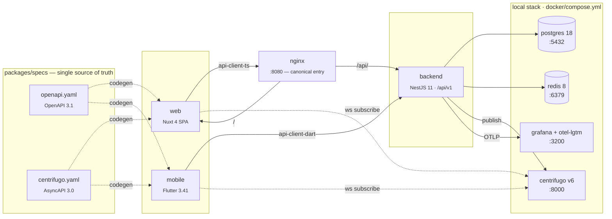
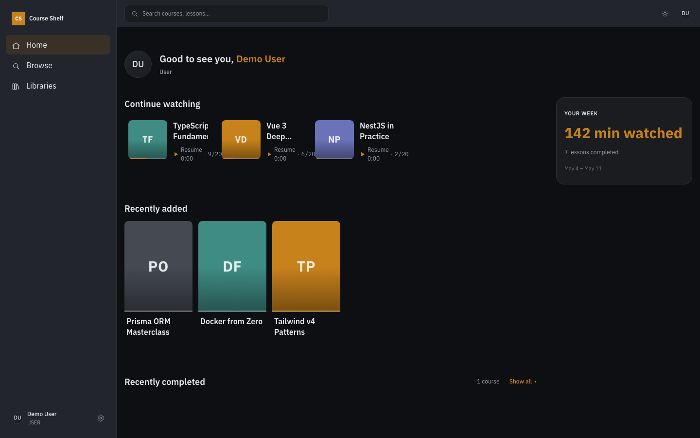
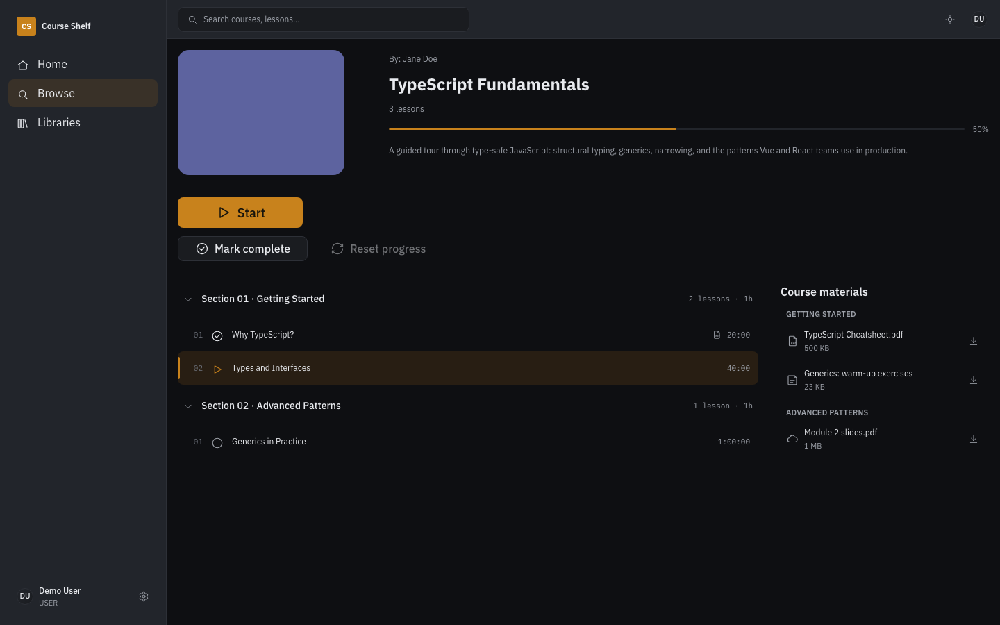
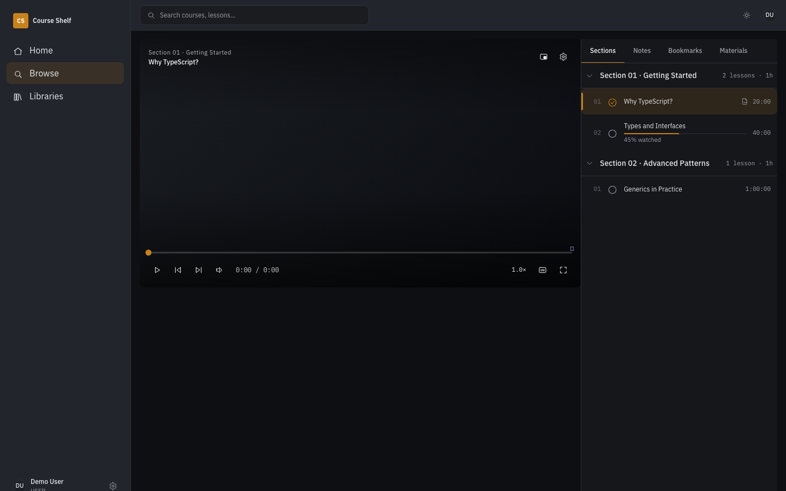
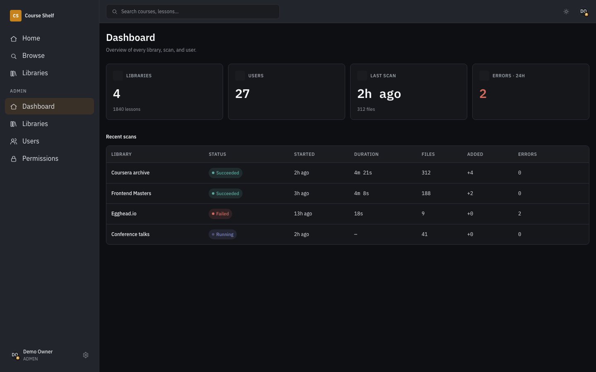

[English](README.md) | [Русский](README.ru.md)

# Course Shelf

**Local-first Coursera** -- a spec-first monorepo for building an online learning platform, designed for AI-agent-driven development.

[](https://github.com/example/course-shelf/actions)
[](LICENSE)
[](https://nodejs.org/)
[](https://pnpm.io/)

---

Course Shelf is a full-stack learning platform with a web client, a Flutter mobile app, and a NestJS backend -- all generated from a single OpenAPI + AsyncAPI contract. Every wire format, every design token, and every generated client is enforced by CI, so the spec is never just documentation: it is the source of truth the codebase cannot drift from.

The project is built to be developed with AI coding agents. A task stack lives inside the repository, project rules are codified in `.claude/CLAUDE.md`, and drift guards catch the mistakes agents make most often -- missing translations, out-of-sync generated clients, undocumented API routes, and hardcoded colors.

## Architecture



The nginx reverse proxy folds the SPA (`web:3001`) and the API (`backend:3000`) onto a single origin at `:8080`, eliminating CORS preflights and enabling relative API URLs. Direct access to individual service ports remains available for tooling that needs to bypass the proxy.

## Feature Highlights

**Spec-first API contract.** One OpenAPI 3.1 file and one AsyncAPI 3.0 file generate both the TypeScript and Dart API clients. A CI drift guard regenerates every client and fails the PR if the committed output does not match. At runtime, `express-openapi-validator` rejects requests that are not in the spec -- the backend cannot serve an undocumented route.

**Multi-platform from day one.** Nuxt 4 SPA for the web, Flutter 3.41 for mobile. Both consume the same generated client and the same design-token pipeline. Four locales (en, ru, uk, el) are wired across all three apps with a key-parity check that runs in CI.

**Design system with enforcement.** W3C Design Tokens flow from JSON into CSS custom properties, TypeScript constants, and a Dart theme. `@app/ui` ships 11 Vue brand components, each with a colocated Storybook story and a Vitest spec (181 tests total). Stylelint bans hex literals and `!important` -- every color comes from a token.

**Realtime via Centrifugo.** The backend publishes events to Centrifugo over its GRPC API. Web and mobile clients subscribe over websockets using short-lived tokens issued by `POST /api/v1/realtime/token`. Channel definitions are generated from the AsyncAPI spec.

**Observable by default.** Sentry captures errors. OpenTelemetry ships traces and metrics to a local Grafana + LGTM stack at `:3200`. Health checks at `/api/v1/health` report the status of PostgreSQL, Redis, and Centrifugo.

**AI-agent-ready workflow.** The repository carries its own task stack (`specs/tasks/active.md`), project rules (`.claude/CLAUDE.md`), domain handbooks (`.claude/docs/*`), and a subagent roster. A fresh Claude Code session picks up the rules automatically and starts from the top of the task stack.

## Tech Stack

### Apps

| App                | Stack                                 | Key libraries                                                              |
| ------------------ | ------------------------------------- | -------------------------------------------------------------------------- |
| **`apps/backend`** | NestJS 11, Prisma 7, CQRS             | Better Auth, express-openapi-validator, nestjs-i18n, Sentry, OpenTelemetry |
| **`apps/web`**     | Nuxt 4 (SPA), Nuxt UI v4, Tailwind v4 | @nuxtjs/i18n, generated api-client-ts, SCSS + BEM                          |
| **`apps/mobile`**  | Flutter 3.41                          | flutter_bloc, get_it, Dio, slang (i18n), Firebase Messaging, Sentry        |

### Shared Packages

| Package                        | Purpose                                                                                     |
| ------------------------------ | ------------------------------------------------------------------------------------------- |
| **`packages/specs`**           | OpenAPI 3.1 + AsyncAPI 3.0 -- single source of truth for every wire contract                |
| **`packages/api-client-ts`**   | Generated TypeScript client via `@hey-api/openapi-ts` (read-only)                           |
| **`packages/api-client-dart`** | Generated Dart client via `openapi-generator-cli` (read-only)                               |
| **`packages/ui`**              | `@app/ui` Vue brand components with colocated Storybook stories and Vitest specs            |
| **`packages/ui_flutter`**      | Shared Flutter widgets and theme binding                                                    |
| **`packages/design-tokens`**   | W3C Design Tokens pipeline: JSON to CSS custom properties, TypeScript constants, Dart theme |
| **`packages/eslint-config`**   | Shared ESLint flat config                                                                   |
| **`packages/tsconfig`**        | Shared TypeScript configs                                                                   |

### Local Infrastructure

| Service    | Version     | Port | Notes                                              |
| ---------- | ----------- | ---- | -------------------------------------------------- |
| postgres   | 18.1-alpine | 5432 | Init SQL in `docker/postgres/init.sql`             |
| redis      | 8.6-alpine  | 6379 | Append-only persistence                            |
| centrifugo | v6          | 8000 | Realtime websocket, config in `docker/centrifugo/` |
| backend    | Dockerfile  | 3000 | Waits on postgres, redis, centrifugo               |
| web        | Dockerfile  | 3001 | Nuxt dev server                                    |
| nginx      | --          | 8080 | Reverse proxy: same-origin SPA + API               |
| otel-lgtm  | Grafana     | 3200 | Local Grafana + LGTM observability stack           |

Containers mount the repository as a volume, so edits reach the running container without a rebuild. Do not run `pnpm dev` alongside `docker compose up` -- they share the same host ports.

### CI (GitHub Actions)

- **Backend:** lint, typecheck, test with coverage enforcement
- **Web:** lint, typecheck, test
- **Specs:** OpenAPI + AsyncAPI validation, spec bundle
- **Codegen drift guard:** regenerates every client, fails on `git diff`
- **UI audit:** every `@app/ui` component must have both a Storybook story and a Vitest spec
- **Security:** `pnpm audit`, TruffleHog secret scan, `license-checker` with an OSI-permissive allowlist

## Quick Start

Goal: a fresh clone to all three apps running locally **in under 15 minutes**.

### Prerequisites

| Tool                    | Minimum | Check                                        |
| ----------------------- | ------- | -------------------------------------------- |
| Node.js                 | 24      | `node -v`                                    |
| pnpm                    | 10      | `pnpm -v`                                    |
| Docker + Docker Compose | recent  | `docker --version && docker compose version` |
| Flutter (mobile only)   | 3.41    | `flutter --version`                          |

### 1 — Clone, install, generate

```sh
git clone <this-repo> course-shelf
cd course-shelf
pnpm install                     # ~2 min cold, ~10 s warm
pnpm spec:codegen                # generate TS + Dart API clients from the spec
pnpm design:build                # generate CSS / TS / Dart design tokens
```

Both generators emit gitignored output — every clone needs them before lint, typecheck, or any IDE will resolve types.

### 2 — Boot the local stack

```sh
docker compose -f docker/compose.yml up -d
docker compose -f docker/compose.yml logs -f backend --tail=50    # follow until "Backend listening on …"
```

Containers mount the repository as a volume, so subsequent edits reach the running container without a rebuild. **Do not** run `pnpm dev` alongside `docker compose up` — they share the same host ports.

### 3 — Verify

```sh
curl http://localhost:8080/api/v1/health
# {"status":"ok","dependencies":{"db":"ok","redis":"ok","centrifugo":"ok"}}
```

Then open the app:

| URL                            | What you get                                   |
| ------------------------------ | ---------------------------------------------- |
| `http://localhost:8080`        | Canonical SPA entry (nginx proxy, same-origin) |
| `http://localhost:3001`        | Web app directly (bypasses the proxy)          |
| `http://localhost:3000/api/v1` | Backend API directly                           |
| `http://localhost:6006`        | `@app/ui` Storybook                            |
| `http://localhost:3200`        | Grafana + LGTM dashboards                      |

### 4 — First sign-in

The first user to call `POST /api/v1/setup/owner` becomes the owner; subsequent attempts return 409. The SPA routes a fresh install through `/setup` automatically — visit `http://localhost:8080`, fill in email + password, and the wizard hands off to the dashboard.

### 5 — Mobile (optional)

```sh
cd apps/mobile
flutter pub get
flutter run                     # picks up the API base URL from --dart-define args
```

By default the simulator points at `http://10.0.2.2:8080/api/v1` (Android) or `http://localhost:8080/api/v1` (iOS).

## Screenshots

Captured against the running Stage A web prototype at 1440 × 900, dark theme. All four shots are produced reproducibly by `pnpm screenshots` (Playwright headless against `apps/web` with hermetic API mocks — see [`docs/screenshots/README.md`](docs/screenshots/README.md) and [`scripts/screenshots.ts`](scripts/screenshots.ts)).

### Home

Continue-watching shelf, recently-added shelf and the "Your week" stats rail.



### Course detail

Hero with progress bar, two-column layout with the sections list on the left and the materials right-rail grouped by section.



### Lesson player

Chrome overlay, scrubber and sidebar with the Sections / Notes / Bookmarks / Materials tabs.



### Admin dashboard

Stat cards (libraries, users, last scan, errors-in-24h) and the recent-scans table.



The `apps/mobile` Stage A capture is not yet automated — when the mobile home is ready, add `docs/screenshots/mobile-home.png` and embed it alongside.

## Repository Layout

```
apps/
  backend/          NestJS 11 + Prisma 7 + CQRS + Better Auth
  web/              Nuxt 4 (SPA) + Nuxt UI v4 + Tailwind v4
  mobile/           Flutter 3.41 + flutter_bloc + get_it + Dio
packages/
  specs/            OpenAPI 3.1 + AsyncAPI 3.0 (source of truth)
  api-client-ts/    generated TS client -- never edit by hand
  api-client-dart/  generated Dart client -- never edit by hand
  ui/               @app/ui Vue components + Storybook
  ui_flutter/       app_ui Flutter widgets
  design-tokens/    tokens pipeline: JSON -> CSS / TS / Dart
  eslint-config/    shared ESLint flat config
  tsconfig/         shared TS configs
specs/
  tasks/            active.md (LIFO work stack) + done.md (archive)
  design/           tokens JSON + component inventory
docker/             compose.yml + service configs + nginx proxy
scripts/            setup.sh + cross-repo helpers
.claude/            CLAUDE.md, docs/, subagents
.github/            CI workflows, PR / issue templates
```

## Scripts Reference

| Command                   | What it does                                            |
| ------------------------- | ------------------------------------------------------- |
| `pnpm spec:validate`      | Redocly + AsyncAPI lint                                 |
| `pnpm spec:bundle`        | Bundle OpenAPI to a single `dist/openapi.json`          |
| `pnpm spec:codegen`       | Regenerate every API client from the spec               |
| `pnpm spec:contract-test` | Run contract tests against the spec                     |
| `pnpm design:build`       | Regenerate CSS, TypeScript, and Dart design tokens      |
| `pnpm design:audit`       | Cross-check design inventory against actual components  |
| `pnpm lint`               | ESLint across every workspace (Turbo)                   |
| `pnpm typecheck`          | TypeScript check across every workspace (Turbo)         |
| `pnpm test`               | Vitest across every workspace (Turbo)                   |
| `pnpm build`              | Production build across every workspace (Turbo)         |
| `pnpm storybook`          | `@app/ui` Storybook on `:6006`                          |
| `pnpm check:i18n`         | Locale key-parity check across backend, web, and mobile |
| `pnpm format`             | Prettier                                                |
| `pnpm stylelint`          | Stylelint for SCSS and Vue files                        |
| `pnpm e2e`                | Playwright end-to-end tests                             |

## Drift Protections

| What could drift                                 | What stops it                                        |
| ------------------------------------------------ | ---------------------------------------------------- |
| API route not in spec                            | `express-openapi-validator` rejects at runtime       |
| Generated TS or Dart client out of sync          | `codegen-drift` CI job runs `spec:codegen` and diffs |
| Hex color in a component                         | Stylelint `color-no-hex: true`                       |
| Inline `style=""` or `!important`                | Stylelint rules                                      |
| Component without Storybook story or Vitest spec | `pnpm --filter @app/ui audit:components` in CI       |
| Design token used but not documented             | `pnpm design:audit` cross-checks inventory           |
| Missing translations in a locale                 | `pnpm check:i18n` key-parity check                   |
| Secret committed to the repo                     | TruffleHog on every PR                               |
| Unapproved dependency license                    | `license-checker` OSI-permissive allowlist           |

## Requirements

| Requirement             | Version                            |
| ----------------------- | ---------------------------------- |
| Node.js                 | >= 24                              |
| pnpm                    | >= 10                              |
| Docker + Docker Compose | any recent version                 |
| Flutter + Dart          | 3.41 + 3.8 (optional, mobile only) |

## Documentation

| Topic                                              | File                                                             |
| -------------------------------------------------- | ---------------------------------------------------------------- |
| Backend, CQRS, Prisma, API conventions             | [`.claude/docs/handbook.md`](.claude/docs/handbook.md)           |
| Design system, @app/ui, tokens, BEM                | [`.claude/docs/design-system.md`](.claude/docs/design-system.md) |
| i18n across web, mobile, and backend               | [`.claude/docs/i18n.md`](.claude/docs/i18n.md)                   |
| Testing pyramid, definition of done, PR checklist  | [`.claude/docs/testing.md`](.claude/docs/testing.md)             |
| Security, observability, a11y, performance         | [`.claude/docs/security.md`](.claude/docs/security.md)           |
| Feature migration from another project             | [`.claude/docs/migration.md`](.claude/docs/migration.md)         |
| Project rules (canonical, superset of this README) | [`.claude/CLAUDE.md`](.claude/CLAUDE.md)                         |
| Design workflow and component inventory            | [`specs/design/README.md`](specs/design/README.md)               |
| Docker stack details                               | [`docker/README.md`](docker/README.md)                           |

## Contributing

See [CONTRIBUTING.md](CONTRIBUTING.md) for branch conventions, commit format, and the PR checklist.

## Security

See [SECURITY.md](SECURITY.md) for responsible disclosure and security policy.

## License

[MIT](LICENSE) -- Copyright (c) 2026 Evgeniy Kuznetsov.

## Acknowledgements

Built on NestJS, Nuxt, Flutter, Prisma, Better Auth, Centrifugo, Redocly, AsyncAPI, slang, Tailwind CSS, Storybook, Turborepo, and pnpm. Workflow shaped for AI-agent-driven development.
