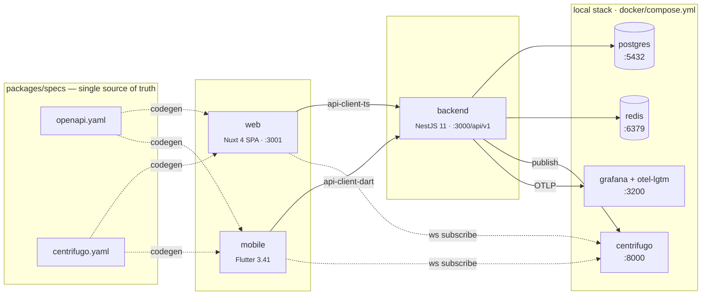

# Spec-first, agent-friendly monorepo boilerplate

A production-shaped greenfield starter for teams that plan to build with
**Claude Design → Claude Code**. Ships with a working backend, web, mobile,
a shared design-token pipeline, a single source of truth for every wire
contract, and the drift guards that make an agentic workflow safe to run
without a human hovering over each keystroke.

Nothing here is a mock. The stack boots, the tests pass, the contracts
validate, the tokens build, and every "this is protected from drift" claim
below is a real CI job or pre-commit check.

## Why this exists

Greenfield projects with AI coding assistants fail for predictable reasons:
the agent renames a field in TypeScript but forgets the Dart client, changes
an API route without updating the OpenAPI spec, drops a hex color into a
component, or leaves the Flutter copy stub-only while the web side has three
locales. By the time the human reviewer catches it, the diff is already tens
of files deep.

This repo codifies the guardrails that stop that drift at the source:

- One OpenAPI + one AsyncAPI file generate both the TypeScript and Dart
  clients. CI fails the PR if the generated output is out of date.
- `express-openapi-validator` rejects runtime requests that aren't in the
  spec — the backend physically cannot serve an undocumented route.
- Stylelint bans hex literals in brand components; every colour has to come
  from a design token.
- A task stack lives in the repo, not in a chat window: every feature is
  pushed onto `specs/tasks/active.md`, checked off as it progresses, and
  archived to `specs/tasks/done.md` with the PR link.
- `.claude/` carries the project rules, subagent roster, and a handbook per
  domain. A fresh Claude Code session picks them up automatically.

## Architecture at a glance



Wire contracts (`packages/specs`) are the single source of truth. Generated
clients (`packages/api-client-{ts,dart}`) are read-only — codegen owns them.

## What's in the box

### Backend — `apps/backend`

- NestJS 11 with CQRS (`@nestjs/cqrs`) and strict URI versioning at `/api/v1/*`
- Better Auth mounted under `/api/v1/auth/*`, backed by Prisma 7 tables
- Centrifugo realtime token endpoint (`POST /api/v1/realtime/token`, TTL ≤ 5 min)
- RFC 9457 `application/problem+json` error envelope via a global filter
- `express-openapi-validator` rejects any request or response that drifts
  from `packages/specs/openapi/openapi.yaml`
- Config module (`AppConfig`) — direct `process.env` access is banned
- Sentry + OpenTelemetry wired in `main.ts`
- nestjs-i18n, @nestjs/throttler, health endpoint with db / redis /
  centrifugo dependency status
- Vitest suite (30 tests, includes mock SMS / email / storage adapters for
  local dev)

### Web — `apps/web`

- Nuxt 4 in SPA mode (`ssr: false`), Nuxt UI v4, Tailwind v4
- `@nuxtjs/i18n` with per-component `<i18n lang="json">` blocks, not global
  message files (`useI18n({ useScope: 'local' })`)
- All HTTP goes through the generated `@app/api-client-ts`
- Auth state via Better Auth's `useSession()` + `AuthGate`-style layout
- SCSS with BEM naming, design tokens as CSS custom properties

### Mobile — `apps/mobile`

- Flutter 3.41, feature-first layout (`domain/data/presentation`)
- `flutter_bloc` for state, `get_it` for DI, Dio for HTTP
- Ready-made auth vertical: welcome / sign-in / sign-up screens, `AuthCubit`,
  `AuthGate`, token storage via `flutter_secure_storage`
- Firebase Messaging push integration, Sentry Flutter
- i18n via `slang`, four locales wired (en / ru / uk / el) across
  `auth` / `common` / `settings` namespaces
- Linked to the shared design system (`app_ui` = `packages/ui_flutter`) and
  the generated Dart client (`app_api_client` = `packages/api-client-dart`)

### Shared contracts — `packages/specs`

- OpenAPI 3.1 (`openapi/openapi.yaml`) + AsyncAPI 3.0 (`asyncapi/centrifugo.yaml`)
- `pnpm spec:validate` (Redocly + AsyncAPI CLI)
- `pnpm spec:bundle` → `dist/openapi.json`
- `pnpm spec:codegen` regenerates:
  - `packages/api-client-ts/src/generated/` via `@hey-api/openapi-ts`
  - `packages/specs/src/openapi-types.ts` via `openapi-typescript`
  - `packages/api-client-dart/lib/generated/` via `openapi-generator-cli` (dart-dio)
  - `packages/api-client-ts/src/realtime/channels.ts` from the AsyncAPI spec
- CI compares the regenerated output against the committed tree — a drift
  means the PR fails

### Design system — `packages/ui` + `packages/ui_flutter` + `packages/design-tokens`

- W3C Design Tokens (`specs/design/tokens/*.json`) → CSS custom properties,
  TypeScript constants, Dart theme — generated by `pnpm design:build`
- `@app/ui` (Vue) — 11 brand components, every one with a colocated
  `*.stories.ts` (Storybook) and `*.spec.ts` (vitest, 181 tests)
- `@app/ui_flutter` — shared Flutter widgets and theme binding
- `pnpm design:audit` cross-checks `specs/design/README.md` inventory
  against the actual component folders

### Local stack — `docker/compose.yml`

| Service    | Version        | Port | Notes                          |
| ---------- | -------------- | ---- | ------------------------------ |
| postgres   | 18.1-alpine    | 5432 | init SQL in `postgres/init.sql`|
| redis      | 8.6-alpine     | 6379 | appendonly                     |
| centrifugo | v6             | 8000 | config in `centrifugo/`        |
| backend    | Dockerfile.dev | 3000 | waits on postgres/redis/centrifugo |
| web        | Dockerfile.dev | 3001 | Nuxt dev server                |
| otel-lgtm  | grafana        | 3200 | local Grafana + LGTM stack     |

Containers mount the repo as a volume, so edits reach the container without
a rebuild. Matching `pnpm dev` and `docker compose up` at the same time
would fight over host ports — pick one.

### CI — `.github/workflows/ci.yml`

- Backend: lint · typecheck · test (with coverage enforcement)
- Web: lint · typecheck · test
- Specs: OpenAPI + AsyncAPI validation, spec bundle
- Codegen drift guard: regenerates every client and fails on `git diff`
- UI audit: every `@app/ui` component must have both a story and a spec
- Security: `pnpm audit`, TruffleHog secret scan, `license-checker` with an
  allowlist of OSI-permissive licenses

## Drift protections — at a glance

| What could drift                      | What stops it                                            |
| ------------------------------------- | -------------------------------------------------------- |
| API route not in spec                 | `express-openapi-validator` rejects at runtime           |
| Generated TS / Dart client out of sync| `codegen-drift` CI job runs `spec:codegen` and diffs     |
| Hex colour snuck into a component     | Stylelint `color-no-hex: true` in `stylelint.config.mjs` |
| Inline `style=""` / `!important`      | Stylelint rules                                          |
| Component without story or spec       | `pnpm --filter @app/ui audit:components` in CI           |
| Design token used but not documented  | `pnpm design:audit` cross-checks inventory               |
| Missing translations in a locale      | `pnpm check:i18n` key-parity check                       |
| Secret committed                      | TruffleHog on every PR                                   |
| Unapproved license                    | `license-checker` allowlist                              |

## Quick start

```sh
git clone <this-repo> my-project
cd my-project
bash scripts/setup.sh            # substitute {{APP_NAME}} / {{APP_SLUG}} / {{APP_DESCRIPTION}}
pnpm install
pnpm spec:codegen                # generate TS + Dart API clients from the spec
pnpm design:build                # generate CSS / TS / Dart tokens
docker compose -f docker/compose.yml up -d
curl localhost:3000/api/v1/health
# → {"status":"ok","dependencies":{"db":"ok","redis":"ok","centrifugo":"ok"}}
```

Open `http://localhost:3001` for the web app and
`http://localhost:8000` for Centrifugo's health endpoint.

### Running in a Claude Code session

```
Read .claude/CLAUDE.md. Push a new entry to specs/tasks/active.md and help me
build <first feature>.
```

`.claude/CLAUDE.md` is loaded automatically as project context.

## Repository layout

```
apps/
  backend/          NestJS 11 + Prisma 7 + CQRS + Better Auth
  web/              Nuxt 4 (SPA) + Nuxt UI v4 + Tailwind v4
  mobile/           Flutter 3.41 + flutter_bloc + get_it + Dio
packages/
  specs/            OpenAPI 3.1 + AsyncAPI 3.0 (source of truth)
  api-client-ts/    generated TS client — never edit by hand
  api-client-dart/  generated Dart client — never edit by hand
  ui/               @app/ui Vue components + Storybook
  ui_flutter/       app_ui Flutter widgets
  design-tokens/    tokens pipeline: JSON → CSS / TS / Dart
  eslint-config/    shared ESLint flat config
  tsconfig/         shared TS configs
specs/
  tasks/            active.md (LIFO work stack) + done.md (archive)
  design/           tokens JSON + component inventory
docker/             compose.yml + service configs
scripts/            setup.sh + cross-repo helpers
.claude/            CLAUDE.md, docs/, subagents
.github/            CI workflows, PR / issue templates
```

## Scripts reference

| Command                | What it does                                             |
| ---------------------- | -------------------------------------------------------- |
| `pnpm spec:validate`   | Redocly + AsyncAPI lint                                  |
| `pnpm spec:bundle`     | Bundle OpenAPI to a single JSON                          |
| `pnpm spec:codegen`    | Regenerate every client from the spec                    |
| `pnpm spec:contract-test` | Run Dredd/Prism-style contract tests                  |
| `pnpm design:build`    | Regenerate CSS / TS / Dart tokens                        |
| `pnpm design:audit`    | Inventory drift report                                   |
| `pnpm lint`            | Turbo — ESLint across every workspace                    |
| `pnpm typecheck`       | Turbo — tsc / nuxt typecheck                             |
| `pnpm test`            | Turbo — vitest across every workspace                    |
| `pnpm build`           | Turbo — production build                                 |
| `pnpm storybook`       | `@app/ui` Storybook on :6006                             |
| `pnpm check:i18n`      | Locale key-parity across backend / web / mobile          |
| `pnpm format`          | Prettier                                                 |
| `pnpm stylelint`       | Stylelint (SCSS + Vue)                                   |

## Customising the template

`scripts/setup.sh` walks the tree and replaces:

- `{{APP_NAME}}` — human-readable name (`"My SaaS"`)
- `{{APP_SLUG}}` — lowercase hyphenated slug (`my-saas`), used as
  docker project name, database name, etc.
- `{{APP_DESCRIPTION}}` — one-line description

It also rewrites the sentinel `YourApp` that sits inside Nuxt `<i18n>` JSON
blocks (vue-i18n can't contain `{{...}}` so those blocks use a literal
instead).

Edit what the setup script doesn't cover:

- `apps/backend/prisma/schema.prisma` — replace the starter domain models
- `docker/postgres/init.sql` — DB extensions and baseline roles
- `apps/backend/src/main.ts` — Sentry DSN, OTel endpoint
- `.claude/CLAUDE.md` — project-specific rules beyond the defaults
- `apps/mobile/android/` and `apps/mobile/ios/` — bundle IDs, Firebase
  config, app icons

## Requirements

- Node.js ≥ 24
- pnpm ≥ 10
- Docker + Docker Compose
- Flutter 3.41 + Dart 3.8 (optional if you're not building mobile)

## Documentation

Shared handbook lives under [.claude/docs](.claude/docs):

| Topic                                      | File                                           |
| ------------------------------------------ | ---------------------------------------------- |
| Backend, CQRS, Prisma, API conventions     | [`handbook.md`](.claude/docs/handbook.md)       |
| Design system, @app/ui, tokens, BEM        | [`design-system.md`](.claude/docs/design-system.md) |
| i18n (web + mobile + backend)              | [`i18n.md`](.claude/docs/i18n.md)               |
| Testing pyramid, DoD, PR checklist         | [`testing.md`](.claude/docs/testing.md)         |
| Security, observability, a11y, performance | [`security.md`](.claude/docs/security.md)       |
| Feature migration from another project     | [`migration.md`](.claude/docs/migration.md)     |

See also [specs/design/README.md](specs/design/README.md) for the design
workflow and [.claude/CLAUDE.md](.claude/CLAUDE.md) for the full set of
project rules.

## Contributing

See [CONTRIBUTING.md](CONTRIBUTING.md).

## Security

See [SECURITY.md](SECURITY.md).

## License

[MIT](LICENSE).

## Acknowledgements

Built on the shoulders of NestJS, Nuxt, Flutter, Prisma, Better Auth,
Centrifugo, Redocly, AsyncAPI, slang, Tailwind, Storybook, Turbo, and pnpm.
Workflow shaped for [Claude Code](https://claude.com/claude-code).
