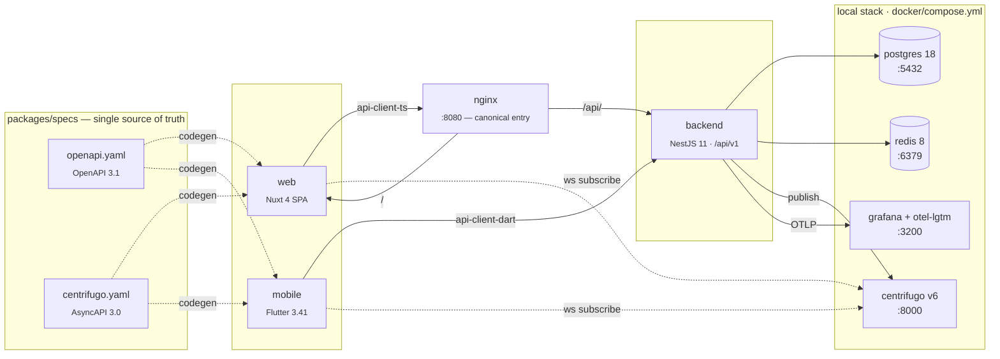

[English](README.md) | [Русский](README.ru.md)

# Course Shelf

**Local-first Coursera** -- спецификация-первичный монорепозиторий для создания платформы онлайн-обучения, спроектированный для разработки с участием AI-агентов.

[](https://github.com/kkucherenkov/course_shelf/actions)
[](LICENSE)
[](https://nodejs.org/)
[](https://pnpm.io/)

> **О зеркале** — разработка ведётся на self-hosted Forgejo; github.com/kkucherenkov/course_shelf — это push-зеркало только для чтения. Issues и pull requests здесь не отслеживаются, ветки могут быть принудительно перезаписаны синхронизацией зеркала. Релизные образы публикуются и в приватный реестр хоумлаба, и публично в `ghcr.io/kkucherenkov/courseshelf-{backend,web}`.

---

Course Shelf -- это полнофункциональная обучающая платформа с веб-клиентом, мобильным приложением на Flutter и бэкендом на NestJS. Всё генерируется из единого контракта OpenAPI + AsyncAPI. Каждый формат передачи данных, каждый дизайн-токен и каждый сгенерированный клиент проверяется в CI, поэтому спецификация -- это не просто документация, а единый источник истины, от которого кодовая база не может отклониться.

Проект создан для разработки с помощью AI-агентов. Внутри репозитория ведётся стек задач, правила проекта формализованы в `.claude/CLAUDE.md`, а автоматические защиты от рассинхронизации отлавливают типичные ошибки агентов -- пропущенные переводы, устаревшие сгенерированные клиенты, недокументированные маршруты API и захардкоженные цвета.

## Архитектура



Обратный прокси nginx объединяет SPA (`web:3001`) и API (`backend:3000`) на едином источнике (origin) на порту `:8080`, устраняя CORS-preflight-запросы и позволяя использовать относительные URL для API. Прямой доступ к отдельным портам сервисов сохраняется для инструментов, которым необходимо обойти прокси.

## Ключевые возможности

**Спецификация как основа API-контракта.** Один файл OpenAPI 3.1 и один файл AsyncAPI 3.0 генерируют как TypeScript-, так и Dart-клиенты API. Защита от рассинхронизации в CI регенерирует каждый клиент и отклоняет PR, если зафиксированный результат не совпадает. Во время выполнения `express-openapi-validator` отклоняет запросы, не описанные в спецификации -- бэкенд не может обслуживать недокументированный маршрут.

**Мультиплатформенность с первого дня.** Nuxt 4 SPA для веба, Flutter 3.41 для мобильных устройств. Оба используют один и тот же сгенерированный клиент и единую цепочку дизайн-токенов. Четыре языковых стандарта (en, ru, uk, el) подключены во всех трёх приложениях с проверкой полноты ключей в CI.

**Система дизайна с принудительным соблюдением правил.** W3C Design Tokens поступают из JSON в CSS custom properties, константы TypeScript и Dart-тему. `@app/ui` содержит 11 фирменных Vue-компонентов, каждый из которых сопровождается colocated-историей Storybook и спецификацией Vitest (всего 181 тест). Stylelint запрещает шестнадцатеричные литералы и `!important` -- каждый цвет берётся из токена.

**Работа в реальном времени через Centrifugo.** Бэкенд публикует события в Centrifugo через GRPC API. Веб- и мобильные клиенты подписываются через веб-сокеты, используя кратковременные токены, выдаваемые эндпоинтом `POST /api/v1/realtime/token`. Определения каналов генерируются из спецификации AsyncAPI.

**Наблюдаемость по умолчанию.** Sentry фиксирует ошибки. OpenTelemetry отправляет трейсы и метрики в локальный стек Grafana + LGTM на порту `:3200`. Проверки состояния на `/api/v1/health` сообщают статус PostgreSQL, Redis и Centrifugo.

**Рабочий процесс для AI-агентов.** Репозиторий содержит собственный стек задач (`specs/tasks/active.md`), правила проекта (`.claude/CLAUDE.md`), предметные справочники (`.claude/docs/*`) и реестр подагентов. Новая сессия Claude Code автоматически подхватывает правила и начинает работу с вершины стека задач.

## Технологический стек

### Приложения

| Приложение         | Стек                                  | Основные библиотеки                                                        |
| ------------------ | ------------------------------------- | -------------------------------------------------------------------------- |
| **`apps/backend`** | NestJS 11, Prisma 7, CQRS             | Better Auth, express-openapi-validator, nestjs-i18n, Sentry, OpenTelemetry |
| **`apps/web`**     | Nuxt 4 (SPA), Nuxt UI v4, Tailwind v4 | @nuxtjs/i18n, сгенерированный api-client-ts, SCSS + BEM                    |
| **`apps/mobile`**  | Flutter 3.41                          | flutter_bloc, get_it, Dio, slang (i18n), Firebase Messaging, Sentry        |

### Общие пакеты

| Пакет                          | Назначение                                                                                    |
| ------------------------------ | --------------------------------------------------------------------------------------------- |
| **`packages/specs`**           | OpenAPI 3.1 + AsyncAPI 3.0 -- единый источник истины для всех контрактов передачи данных      |
| **`packages/api-client-ts`**   | Сгенерированный TypeScript-клиент через `@hey-api/openapi-ts` (только для чтения)             |
| **`packages/api-client-dart`** | Сгенерированный Dart-клиент через `openapi-generator-cli` (только для чтения)                 |
| **`packages/ui`**              | `@app/ui` -- фирменные Vue-компоненты с colocated-историями Storybook и спецификациями Vitest |
| **`packages/ui_flutter`**      | Общие Flutter-виджеты и привязка темы                                                         |
| **`packages/design-tokens`**   | Цепочка W3C Design Tokens: JSON -> CSS custom properties, константы TypeScript, Dart-тема     |
| **`packages/eslint-config`**   | Общая ESLint flat config                                                                      |
| **`packages/tsconfig`**        | Общие конфигурации TypeScript                                                                 |

### Локальная инфраструктура

| Сервис     | Версия      | Порт | Примечания                                                        |
| ---------- | ----------- | ---- | ----------------------------------------------------------------- |
| postgres   | 18.1-alpine | 5432 | Инициализация SQL в `docker/postgres/init.sql`                    |
| redis      | 8.6-alpine  | 6379 | Append-only persistence                                           |
| centrifugo | v6          | 8000 | Веб-сокеты реального времени, конфигурация в `docker/centrifugo/` |
| backend    | Dockerfile  | 3000 | Ожидает готовности postgres, redis, centrifugo                    |
| web        | Dockerfile  | 3001 | Nuxt dev server                                                   |
| nginx      | --          | 8080 | Обратный прокси: единый origin для SPA и API                      |
| otel-lgtm  | Grafana     | 3200 | Локальный стек наблюдаемости Grafana + LGTM                       |

Контейнеры монтируют репозиторий как том, поэтому изменения попадают в работающий контейнер без пересборки. Не запускайте `pnpm dev` одновременно с `docker compose up` -- они используют одни и те же порты на хосте.

### CI (GitHub Actions)

- **Backend:** lint, typecheck, тесты с контролем покрытия
- **Web:** lint, typecheck, тесты
- **Specs:** валидация OpenAPI + AsyncAPI, сборка спецификации
- **Защита от рассинхронизации кодогенерации:** регенерирует все клиенты, отклоняет при наличии `git diff`
- **Аудит UI:** каждый компонент `@app/ui` должен иметь историю Storybook и спецификацию Vitest
- **Безопасность:** `pnpm audit`, TruffleHog для поиска секретов, `license-checker` с разрешительным OSI-списком лицензий

## Быстрый старт

Цель: от свежего клона до трёх запущенных приложений локально **менее чем за 15 минут**.

### Требования

| Инструмент                 | Минимум       | Проверка                                     |
| -------------------------- | ------------- | -------------------------------------------- |
| Node.js                    | 24            | `node -v`                                    |
| pnpm                       | 10            | `pnpm -v`                                    |
| Docker + Docker Compose    | свежая версия | `docker --version && docker compose version` |
| Flutter (только мобильное) | 3.41          | `flutter --version`                          |

### 1 — Клонирование, установка, генерация

```sh
git clone <this-repo> course-shelf
cd course-shelf
pnpm install                     # ~2 мин с нуля, ~10 с при кеше
pnpm spec:codegen                # генерация TS + Dart API-клиентов из спецификации
pnpm design:build                # генерация CSS / TS / Dart дизайн-токенов
```

Оба генератора создают файлы, которые лежат в `.gitignore` — каждый клон должен запустить их до lint, typecheck и до того, как IDE сможет распознать типы.

### 2 — Запуск локального стека

```sh
docker compose -f docker/compose.yml up -d
docker compose -f docker/compose.yml logs -f backend --tail=50    # ждём "Backend listening on …"
```

Контейнеры монтируют репозиторий как volume, так что последующие правки попадают внутрь без пересборки. **Не запускайте** `pnpm dev` параллельно с `docker compose up` — они конкурируют за одни и те же порты.

### 3 — Проверка

```sh
curl http://localhost:8080/api/v1/health
# {"status":"ok","dependencies":{"db":"ok","redis":"ok","centrifugo":"ok"}}
```

Затем откройте приложение:

| URL                            | Описание                                                   |
| ------------------------------ | ---------------------------------------------------------- |
| `http://localhost:8080`        | Каноническая точка входа SPA (прокси nginx, единый origin) |
| `http://localhost:3001`        | Веб-приложение напрямую (в обход прокси)                   |
| `http://localhost:3000/api/v1` | API бэкенда напрямую                                       |
| `http://localhost:6006`        | Storybook `@app/ui`                                        |
| `http://localhost:3200`        | Дашборды Grafana + LGTM                                    |

### 4 — Первый вход

Первый пользователь, который вызывает `POST /api/v1/setup/owner`, становится владельцем; последующие попытки возвращают 409. SPA автоматически перенаправляет свежую установку на `/setup` — откройте `http://localhost:8080`, введите email и пароль, мастер передаст управление дашборду.

### 5 — Мобильное (опционально)

```sh
cd apps/mobile
flutter pub get
flutter run                     # подхватывает API base URL через --dart-define
```

По умолчанию симулятор смотрит на `http://10.0.2.2:8080/api/v1` (Android) или `http://localhost:8080/api/v1` (iOS).

## Скриншоты

Сняты с работающего Stage A web-прототипа, 1440 × 900, тёмная тема. Все четыре кадра делаются воспроизводимо командой `pnpm screenshots` (Playwright headless по `apps/web` с моками всех API-вызовов — см. [`docs/screenshots/README.md`](docs/screenshots/README.md) и [`scripts/screenshots.ts`](scripts/screenshots.ts)).

### Главная

Полка «Continue watching», «Recently added» и сайдбар «Your week» со статистикой за неделю.


### Карточка курса

Hero с прогрессом, две колонки: список разделов слева и правый рельс материалов, сгруппированных по секциям.


### Плеер урока

Chrome-оверлей, скраббер и боковая панель с вкладками Sections / Notes / Bookmarks / Materials.


### Админ-дашборд

Stat-карточки (библиотеки, пользователи, последний скан, ошибки за 24 ч) и таблица недавних сканов.


Снимок Stage A для `apps/mobile` пока не автоматизирован — когда мобильная главная будет готова, добавьте `docs/screenshots/mobile-home.png` и подставьте его в эту же секцию.

## Структура репозитория

```
apps/
  backend/          NestJS 11 + Prisma 7 + CQRS + Better Auth
  web/              Nuxt 4 (SPA) + Nuxt UI v4 + Tailwind v4
  mobile/           Flutter 3.41 + flutter_bloc + get_it + Dio
packages/
  specs/            OpenAPI 3.1 + AsyncAPI 3.0 (источник истины)
  api-client-ts/    сгенерированный TS-клиент -- не редактировать вручную
  api-client-dart/  сгенерированный Dart-клиент -- не редактировать вручную
  ui/               @app/ui Vue-компоненты + Storybook
  ui_flutter/       app_ui Flutter-виджеты
  design-tokens/    цепочка токенов: JSON -> CSS / TS / Dart
  eslint-config/    общая ESLint flat config
  tsconfig/         общие конфигурации TS
specs/
  tasks/            active.md (LIFO-стек задач) + done.md (архив)
  design/           JSON токенов + реестр компонентов
docker/             compose.yml + конфигурации сервисов + прокси nginx
scripts/            setup.sh + вспомогательные скрипты
.claude/            CLAUDE.md, docs/, подагенты
.github/            рабочие процессы CI, шаблоны PR и issues
```

## Справочник скриптов

| Команда                   | Описание                                                         |
| ------------------------- | ---------------------------------------------------------------- |
| `pnpm spec:validate`      | Линтинг через Redocly + AsyncAPI                                 |
| `pnpm spec:bundle`        | Сборка OpenAPI в единый `dist/openapi.json`                      |
| `pnpm spec:codegen`       | Регенерация всех API-клиентов из спецификации                    |
| `pnpm spec:contract-test` | Запуск контрактных тестов по спецификации                        |
| `pnpm design:build`       | Регенерация CSS-, TypeScript- и Dart-дизайн-токенов              |
| `pnpm design:audit`       | Перекрёстная проверка реестра дизайна и существующих компонентов |
| `pnpm lint`               | ESLint по всем рабочим пространствам (Turbo)                     |
| `pnpm typecheck`          | Проверка TypeScript по всем рабочим пространствам (Turbo)        |
| `pnpm test`               | Vitest по всем рабочим пространствам (Turbo)                     |
| `pnpm build`              | Сборка production по всем рабочим пространствам (Turbo)          |
| `pnpm storybook`          | Storybook для `@app/ui` на порту `:6006`                         |
| `pnpm check:i18n`         | Проверка полноты ключей локализации в backend, web и mobile      |
| `pnpm format`             | Форматирование через Prettier                                    |
| `pnpm stylelint`          | Stylelint для SCSS и Vue-файлов                                  |
| `pnpm e2e`                | Сквозные тесты через Playwright                                  |

## Защита от рассинхронизации

| Что может разойтись                                     | Что это предотвращает                                             |
| ------------------------------------------------------- | ----------------------------------------------------------------- |
| Маршрут API не описан в спецификации                    | `express-openapi-validator` отклоняет запрос при выполнении       |
| Сгенерированный TS- или Dart-клиент устарел             | CI-задача `codegen-drift` запускает `spec:codegen` и сверяет diff |
| Шестнадцатеричный цвет в компоненте                     | Stylelint `color-no-hex: true`                                    |
| Инлайн `style=""` или `!important`                      | Правила Stylelint                                                 |
| Компонент без истории Storybook или спецификации Vitest | `pnpm --filter @app/ui audit:components` в CI                     |
| Дизайн-токен используется, но не документирован         | `pnpm design:audit` проверяет реестр                              |
| Пропущенные переводы в локализации                      | `pnpm check:i18n` -- проверка полноты ключей                      |
| Секрет зафиксирован в репозитории                       | TruffleHog на каждый PR                                           |
| Нелицензионно-чистая зависимость                        | `license-checker` с разрешительным OSI-списком                    |

## Системные требования

| Требование              | Версия                                                    |
| ----------------------- | --------------------------------------------------------- |
| Node.js                 | >= 24                                                     |
| pnpm                    | >= 10                                                     |
| Docker + Docker Compose | любая актуальная версия                                   |
| Flutter + Dart          | 3.41 + 3.8 (опционально, только для мобильной разработки) |

## Документация

| Тема                                                         | Файл                                                             |
| ------------------------------------------------------------ | ---------------------------------------------------------------- |
| Бэкенд, CQRS, Prisma, соглашения API                         | [`.claude/docs/handbook.md`](.claude/docs/handbook.md)           |
| Система дизайна, @app/ui, токены, BEM                        | [`.claude/docs/design-system.md`](.claude/docs/design-system.md) |
| i18n в вебе, мобильном приложении и бэкенде                  | [`.claude/docs/i18n.md`](.claude/docs/i18n.md)                   |
| Пирамида тестирования, критерии готовности, чеклист PR       | [`.claude/docs/testing.md`](.claude/docs/testing.md)             |
| Безопасность, наблюдаемость, доступность, производительность | [`.claude/docs/security.md`](.claude/docs/security.md)           |
| Миграция функционала из другого проекта                      | [`.claude/docs/migration.md`](.claude/docs/migration.md)         |
| Правила проекта (канонические, расширение данного README)    | [`.claude/CLAUDE.md`](.claude/CLAUDE.md)                         |
| Рабочий процесс дизайна и реестр компонентов                 | [`specs/design/README.md`](specs/design/README.md)               |
| Подробности о Docker-стеке                                   | [`docker/README.md`](docker/README.md)                           |

## Участие в проекте

См. [CONTRIBUTING.md](CONTRIBUTING.md) -- правила ветвления, формат коммитов и чеклист для PR.

## Безопасность

См. [SECURITY.md](SECURITY.md) -- политика ответственного раскрытия уязвимостей.

## Лицензия

[MIT](LICENSE) -- Copyright (c) 2026 Evgeniy Kuznetsov.

## Благодарности

Проект создан с использованием NestJS, Nuxt, Flutter, Prisma, Better Auth, Centrifugo, Redocly, AsyncAPI, slang, Tailwind CSS, Storybook, Turborepo и pnpm. Рабочий процесс адаптирован для разработки с участием AI-агентов.
