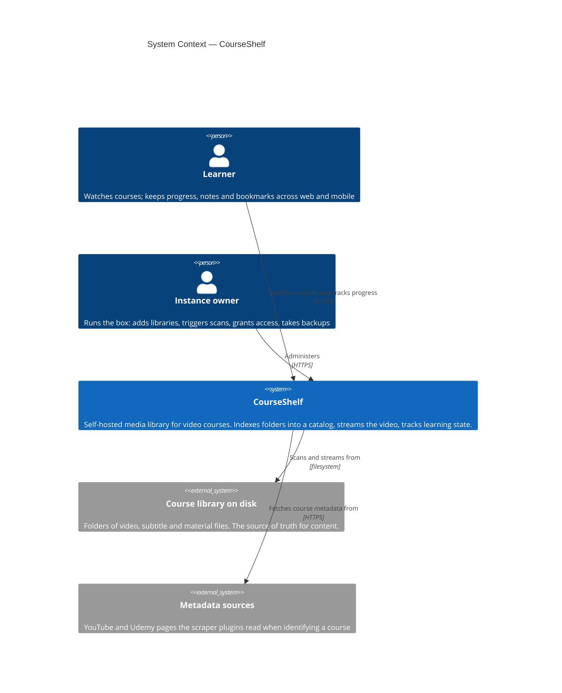
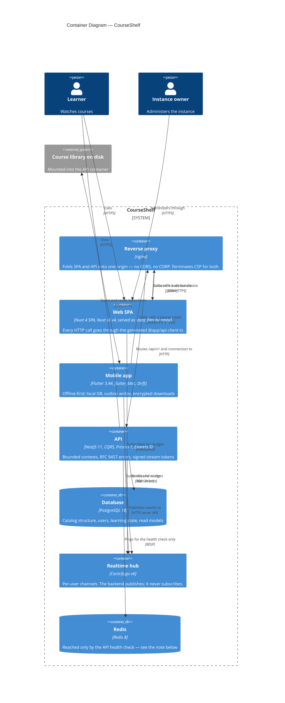
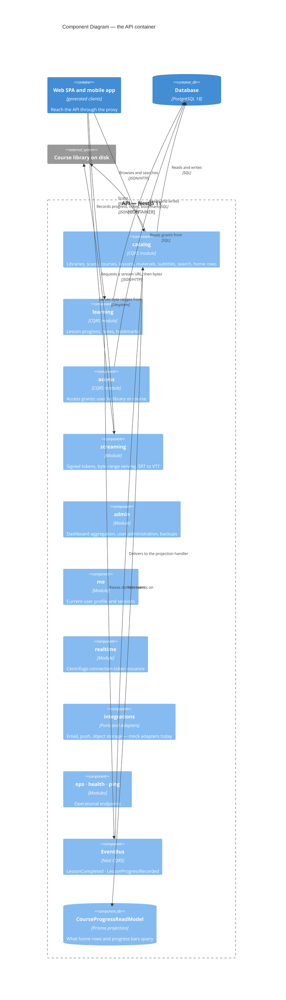
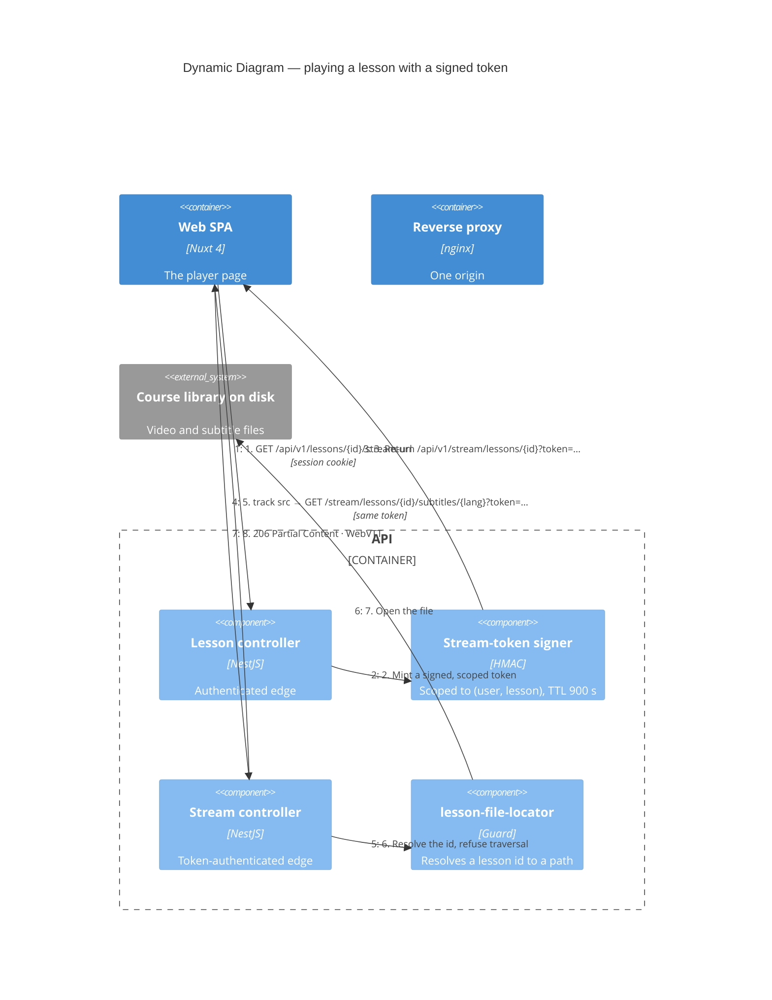
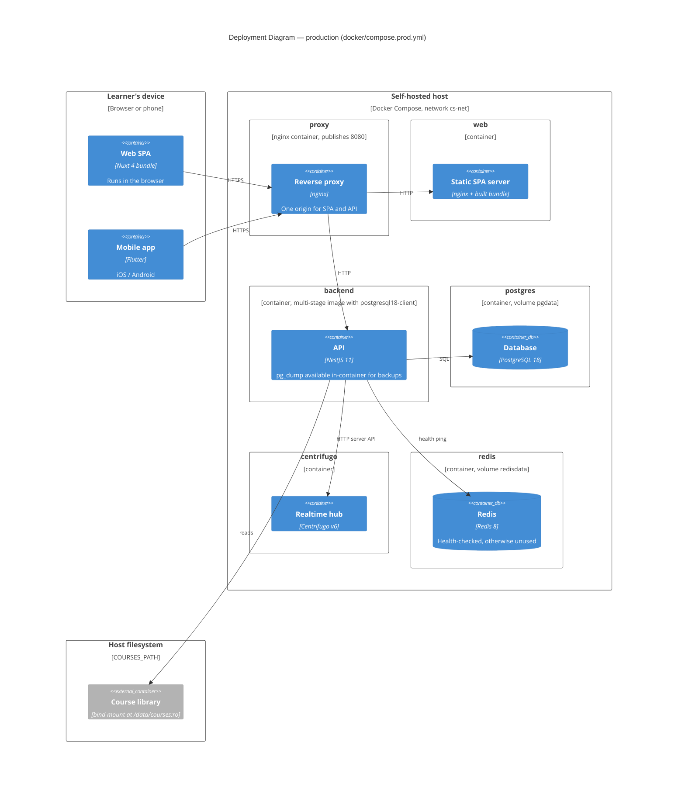

# CourseShelf — architecture

For engineers and architects working on, reviewing, or evaluating this system.

This document explains **how the pieces fit and why**. It does not restate the
coding conventions (`.claude/docs/handbook.md`), the setup steps
([README](../README.md)), or the individual decisions
([`docs/adr/`](./adr/)) — it is the map those hang off.

---

## Contents

1. [What the system is](#1--what-the-system-is)
2. [Topology](#2--topology)
3. [The four source-of-truth pipelines](#3--the-four-source-of-truth-pipelines)
4. [Backend](#4--backend)
5. [Authentication and authorization](#5--authentication-and-authorization)
6. [Streaming](#6--streaming)
7. [Realtime](#7--realtime)
8. [Data model](#8--data-model)
9. [Web client](#9--web-client)
10. [Mobile client](#10--mobile-client)
11. [Design system](#11--design-system)
12. [Testing strategy](#12--testing-strategy)
13. [CI/CD](#13--cicd)
14. [Deployment](#14--deployment)
15. [Configuration](#15--configuration)
16. [Observability](#16--observability)
17. [Extension points](#17--extension-points)
18. [Known architectural debt](#18--known-architectural-debt)

---

## 1 — What the system is

A self-hosted media-library server for video courses: it indexes folders on
disk into a structured catalog, streams the video, and tracks per-user learning
state. Three clients (web SPA, iOS, Android) share one API.

**Design centre:** the filesystem is the source of truth for *content*; the
database is the source of truth for *structure and state*. A scan projects the
former into the latter. Media files are never copied, moved, or transcoded —
losing the database costs you metadata and progress, not your library.

Five constraints shape everything below:

| Constraint | Consequence |
| --- | --- |
| Self-hosted, single tenant | No multi-tenancy plumbing. One instance, one catalog, N users. |
| Contract before code | OpenAPI/AsyncAPI are compiled artefacts, not documentation. |
| Three clients, one contract | Clients are generated. Drift is a build failure, not a bug report. |
| Offline is a first-class mode on mobile | Local DB, outbox writes, encrypted downloads. |
| One design bundle → two platforms | Tokens compile to CSS, TS and Dart from one JSON. |

---

## 2 — Topology



The two people are roles, not accounts — on a single-owner instance they are
usually the same human. The split matters because the admin surface and the
learner surface have different access rules (§5), not because two user types
exist.



Two things in that picture are easy to get wrong, so read them off it
deliberately.

**Nothing uses Redis.** The backend's only call is `ping()`, from
`modules/health/infra/redis.checker.ts` through `common/redis/redis.service.ts`
— a health check on a dependency nothing depends on. Centrifugo does not use it
either: `docker/centrifugo/config.json` declares no engine or broker section, so
it runs on the default in-memory engine, and the only `REDIS_URL` in any compose
file belongs to the `backend` service. The container, its `redisdata` volume and
its healthcheck are currently paying rent for a single `PING`. Whether it should
exist at all is tracked as an open question, not settled here.

Ports, for the local stack: proxy **8080** (use this in the browser), web 3001,
backend 3000, Centrifugo 8000. 3000 and 3001 are published for tooling that
bypasses the proxy; reaching for them in a browser is how you rediscover CORS.


**Why a proxy in front of two images rather than one combined image.**
The SPA and API are separately built, separately versioned, separately scaled,
and separately redeployed. nginx folds them onto one origin so the browser sees
same-origin requests — no CORS preflights, no CORP headers on video, cookies
that just work — and gives one place to terminate CSP for both the HTML and the
API. This is why roadmap cards `E23-F01-S01/S02` (single image, SQLite compose)
were cancelled rather than built.

**Auth transport differs per client by design.** Web uses session cookies;
mobile uses bearer tokens from the Better Auth `bearer` plugin. Same sessions
table, same guard, two credential presentations — see
[ADR-0004](./adr/0004-better-auth-bearer-tokens.md).

---

## 3 — The four source-of-truth pipelines

Every cross-cutting artefact in this repo is **generated from one file**, and
CI fails if the generated output drifts. This is the single most load-bearing
architectural property of the codebase.

### 3.1 API contract

```
packages/specs/openapi/openapi.yaml          ← hand-edited (57 path items)
        │  spec:validate   (Redocly)
        │  spec:bundle     → dist/openapi.json
        └─ spec:codegen
             ├─ openapi-typescript      → @app/specs/openapi-types.ts
             ├─ @hey-api/openapi-ts     → packages/api-client-ts/src/generated/
             └─ openapi-generator-cli   → packages/api-client-dart/lib/src/
                (dart-dio, needs a JVM)
```

At runtime, `express-openapi-validator` loads the same bundle and rejects any
request or response that does not match. **The spec is not documentation of the
implementation; the implementation is checked against the spec.** Adding a
route without editing the YAML first produces a 400 at runtime and a red
`Codegen drift guard` job in CI.

Four route families are exempt from the **validator**
(`apps/backend/src/common/openapi/openapi-validator.middleware.ts`), though all
but one are fully described in the spec:

- `/v1/auth/*` — Better Auth owns that wire protocol and evolves it
  independently; it is the one family with no path item, deliberately.
- `/v1/stream/lessons/…`, `/v1/stream/materials/…`,
  `/v1/admin/backups/{id}/download` — documented as
  `application/octet-stream` / `text/vtt` path items, but skipped at runtime
  because outside production the validator checks *responses* too, and
  streaming a video through a JSON response validator is not something to
  attempt.

The distinction matters: the spec-first rule is about describing the contract,
which these now do. The exemption is a property of that middleware.

### 3.2 Realtime contract

`packages/specs/asyncapi/centrifugo.yaml` defines 7 channels and 8 operations;
codegen emits `@app/api-client-ts/realtime/channels.ts`. Same rule: channel
first, code second.

### 3.3 Design tokens

```
docs/design/shared/tokens.json     ← the Claude Design bundle, source of truth
        └─ pnpm design:build  (packages/design-tokens/scripts/build.ts)
             ├─ emit-scss.ts       → packages/ui/src/tokens.generated.css
             ├─ emit-typescript.ts → packages/ui/src/design-tokens.generated.ts
             └─ emit-dart.ts       → packages/ui_flutter theme
```

One JSON, three emitters, two platforms. Hard-coded hex values, `!important`
and inline `style=""` are banned precisely because they route around this
pipeline. See [ADR-0010](./adr/0010-design-bundle-tokens-source-of-truth.md).

### 3.4 Database schema

`apps/backend/prisma/schema.prisma` → Prisma client + SQL migrations. Postgres
only; no SQLite path exists ([ADR-0008](./adr/0008-postgres-only.md)).

---

## 4 — Backend

**NestJS 11, CQRS without event sourcing** ([ADR-0003](./adr/0003-cqrs-without-event-sourcing.md)),
Prisma 7, Express 5.

### Module map

| Module | Bounded context |
| --- | --- |
| `catalog` | Libraries, scans, courses, sections, lessons, materials, subtitles, instructors, studios, tags, external ids, identify tasks, search, home rows |
| `learning` | Lesson progress, notes, bookmarks |
| `access` | Access grants (user → library \| course) |
| `streaming` | Signed stream/material tokens, byte-range serving, subtitle conversion |
| `admin` | Dashboard aggregation, user administration, backups |
| `me` | Current-user profile and session management |
| `realtime` | Centrifugo connection-token issuance |
| `integrations` | Ports for email / push / object storage (mock adapters today) |
| `ops`, `health`, `ping` | Operational endpoints |

`catalog` is by far the largest and is the one place where a further split
(catalog / ingestion) would be justified if it keeps growing.



The arrow that carries the architecture is `learning → EventBus → catalog`.
Contexts never call each other's repositories: `learning` raises
`LessonCompleted` / `LessonProgressRecorded`, `catalog` subscribes and updates
its projection. Everything else is a module talking to its own storage.

`integrations` is drawn with no outbound arrow on purpose — its adapters are
mocks today. The ports exist so that adding a real one is a provider swap, not
a refactor.

### Layering inside a module

```
domain/        aggregates, value objects, invariants, ports, domain errors
               → zero framework imports, zero Prisma imports
application/   commands/ + queries/ + handlers + event-handlers + projections
infra/         Prisma repositories, filesystem and ffmpeg adapters, scrapers
*.controller   thin HTTP edge: parse → dispatch → map to DTO
```

Handlers depend on **ports** declared in `domain/`; `infra/` supplies the
adapters through the module's providers. The `scan` domain is a good worked
example: `folder-name.parser.ts`, `stem-match.ts`, `course-json.schema.ts` and
the `Scan` aggregate are all pure and heavily unit-tested, while
`node-fs-adapter.ts` and `local-ffmpeg.adapter.ts` hold every side effect.

`course-json.schema.ts` deliberately hand-rolls its parser rather than pulling
in zod or ajv — keeping the domain layer dependency-free is worth ~400 lines of
explicit validation.

### Errors

Every domain error carries an RFC 9457 shape (`type`, `title`, `status`,
`detail`, `code`) and is localised through `nestjs-i18n` by a global filter.
Clients branch on the stable `code`, never on prose.

### Cross-context communication

Contexts do not call each other's repositories. `learning` raises
`LessonCompleted` / `LessonProgressRecorded` on Nest's `EventBus`; `catalog`
subscribes and updates its `CourseProgressReadModel` projection. That read model
is what the home rows and course-progress bars query — the alternative, a
join-and-aggregate on every request, is the N+1 this design exists to avoid.

Note the deliberate shape: **events for read-model maintenance, not for state
reconstruction.** There is no event store and no replay. If you need history,
add a table.

---

## 5 — Authentication and authorization

### Authentication — Better Auth, mounted inside versioning

Better Auth owns `/api/v1/auth/*` end to end: sign-up, sign-in, sessions,
password reset, email verification, the `admin` plugin (roles, ban,
impersonation) and the `bearer` plugin. **No hand-written JWT, hashing, or
session code exists in this repo, and none should be added** — that is the
whole point of ADR-0004.

The `user`, `session`, `account` and `verification` Prisma models are Better
Auth's schema with two additions: `role` / `banned` / `banReason` /
`banExpires` from the admin plugin, and a `displayName` additional field.

`AuthGuard` resolves a session from either a cookie or a bearer token and
attaches it to the request. `AdminGuard` layers the role check on top.

Sign-in is rate-limited by a dedicated middleware
(`common/auth/sign-in-rate-limit.middleware.ts`) in addition to the global
`ThrottlerGuard`.

### Authorization — explicit grants, cached

Content visibility is **not** role-derived. `AccessGrant` rows map a user to a
library or a single course at `READ` level; `AuthorizationService.canSee()` is
the one question every content query asks.

Because that question is asked on nearly every request, the answer is memoised:
`LruAuthorizationService` caches each `canSee()` result for `AUTHZ_CACHE_TTL_MS`
(default 30 s). The trade-off is explicit and bounded — a revoked grant can
remain effective for up to 30 seconds.

A library grant is **transitive over time**: courses discovered by a later scan
into that library become visible without touching grants. That is the intended
semantics, and it is why library grants are the recommended default.

---

## 6 — Streaming

Progressive HTTP with byte ranges. No HLS, no DASH, no transcoding
([ADR-0009](./adr/0009-progressive-streaming-no-hls.md)) — the files are
already encoded, and a self-hosted box on a LAN does not need adaptive bitrate.

Two-step flow, because `<video src>` cannot carry an `Authorization` header:

```
1. GET /api/v1/lessons/{id}/stream-url        (authenticated)
   → { url: "/api/v1/stream/lessons/{id}?token=…" }
      HMAC-signed, scoped to (user, lesson), TTL 900 s
      (STREAM_TOKEN_TTL_SECONDS)

2. GET /api/v1/stream/lessons/{id}?token=…    (token-authenticated)
   → 206 Partial Content, Accept-Ranges: bytes
```



Steps 4 and 5 are why the token is a query parameter rather than a header:
neither `<video src>` nor `<track src>` can send `Authorization`. The subtitle
route was designed for step 5 from the start — and then went unwired on the web
until `E26-F01-S01`, which is a good reminder that a route existing and a route
being reachable are different claims.

Step 6 is the security boundary. Path traversal is contained in
`lesson-file-locator.ts`, not at the controller, so every caller inherits the
guard instead of each one re-implementing it.

Materials follow the same pattern with a `material`-scoped token; backup
downloads use a third signer with a 300 s TTL.

Subtitles are served from `/stream/lessons/{id}/subtitles/{language}`; `.srt`
is converted to WebVTT on the fly and the result cached next to the source as
`*.cache.vtt` (which `stem-match.ts` then knows to ignore on the next scan).

`lesson-file-locator.ts` is the guard that keeps a lesson id from resolving to
an arbitrary path — path traversal is contained there, not at the controller.

---

## 7 — Realtime

Centrifugo v6, single node on its default in-memory engine, fronted by the
same nginx origin. It is **not** wired to Redis: `docker/centrifugo/config.json`
declares no engine or broker section, and no compose file sets a Centrifugo
Redis address.

`POST /api/v1/realtime/token` mints a short-lived connection JWT
(`CENTRIFUGO_TOKEN_TTL_SECONDS`, default **300 s**). Channels carry the user id
so Centrifugo enforces per-user subscription boundaries.

Channels (`packages/specs/asyncapi/centrifugo.yaml`):

| Channel | Carries |
| --- | --- |
| `systemHealth` | instance health pings |
| `libraryScan` | live scan progress: files scanned, current file, counters |
| `scansUser` | scan lifecycle events for one user |
| `notesLesson` | note updated |
| `progressUser` | progress updated |
| `maintenanceBackfill` | backfill started / progress / finished |

The backend publishes; it never subscribes. Realtime is a **notification
channel, not a transport** — every client refetches through the HTTP API after
a nudge. This keeps Centrifugo optional: lose it and the apps degrade to
polling-free-but-stale, not broken.

---

## 8 — Data model

31 models. The shape in five groups:

**Auth** — `User`, `Session`, `Account`, `Verification` (Better Auth's).

**Ingestion** — `Library` (unique `rootPath`) → `Scan` (status machine:
`running → succeeded | failed | cancelled`) → `ScanErrorRecord` (per-file,
non-fatal) and `DiscoveredFile` (`path` + `mtime` + `size`, unique per scan —
this is the incremental-scan signature).

**Catalog** — `Course` → `Section` → `Lesson` → (`Material`, `Subtitle`).
Many-to-many to `Instructor`, `Studio`, `Tag` through explicit join models.
`ExternalId` links a course to an upstream source; `IdentifyTask` holds a
proposed metadata match awaiting apply/discard.

**Learning** — `LessonProgress` (per user per lesson; the 90 % completion
threshold lives in the `LessonProgress` aggregate,
`learning/domain/progress/lesson-progress.ts:108`, and crosses **at most
once**), `Bookmark`, `Note` (unique per user+lesson), and
`CourseProgressReadModel` — the denormalised projection maintained by event
handlers.

**Access** — `AccessGrant`, unique on `(userId, targetKind, libraryId, courseId)`.

Two properties worth noticing:

- **The catalog is disposable.** Everything under *Ingestion* and *Catalog* can
  be rebuilt by re-scanning. Everything under *Learning* and *Access* cannot —
  that is what backups are actually protecting.
- **`CourseProgressReadModel` is the only denormalisation.** It exists because
  the home rows would otherwise aggregate across every lesson of every course on
  every page load.

---

## 9 — Web client

**Nuxt 4 in SPA mode (`ssr: false`)** — [ADR-0005](./adr/0005-nuxt-spa-no-ssr.md).
A single-tenant media server behind a login has nothing to gain from SSR: no
SEO, no cold-start audience, and bearer/cookie auth is simpler with one
execution context.

- Nuxt UI v4 + Tailwind 4 for layout primitives; `@app/ui` for everything
  brand-shaped.
- **Every HTTP call goes through `@app/api-client-ts`.** Hand-written `fetch`
  against the API is a review-stopper.
- `@nuxtjs/i18n`, locale modules at `apps/web/i18n/locales/<locale>.ts`. The
  old SFC `<i18n>` block pattern is forbidden.
- Runtime config is served as a separate same-origin file (`_app-config.js`) so
  the CSP can forbid inline scripts.
- Route guarding is one global middleware (`app/middleware/auth.global.ts`)
  that also owns the first-run `hasUsers` probe and the `/setup` lock.

20 pages: home, browse, search, libraries, course detail, lesson player,
settings, the auth set (sign-in / sign-up / forgot / reset / setup), and the
admin section (dashboard, libraries + detail, users, permissions + detail).

---

## 10 — Mobile client

**Flutter 3.44, `flutter_bloc` + `get_it` + Dio** — [ADR-0006](./adr/0006-bloc-on-mobile.md).

Feature-first layering, mirroring the backend's shape:

```
lib/features/<feature>/
  domain/         entities, repository interfaces
  data/           repository impls, API adapters, local data sources
  presentation/   screens, widgets, bloc/ (bloc + event + state)
lib/shared/db/    Drift: tables, DAOs, migrations
lib/i18n/         slang, 4 locales
```

Eight features: auth, home, browse, search, course_detail, player, downloads,
settings.

### The offline model

This is the most architecturally interesting part of the mobile app.

**Reads** — a Drift database mirrors what the app has seen. Downloaded lessons
carry their own `lesson_title` / `course_title` (denormalised in the v2→v3
migration) so the Downloads tab renders with no network and no catalog cache.

**Downloads** — resumable, and **encrypted at rest with AES-256-GCM**,
chunked so each block gets a distinct nonce (`chunked_gcm_writer.dart`). The
key lives in `flutter_secure_storage`. Playback goes through a local loopback
server that decrypts on demand, so the video player and every other process on
the device only ever see plaintext bytes in transit, never a plaintext file.

**Writes** — three outbox tables (`progress_outbox`, `notes_outbox`,
`bookmarks_outbox`) with a shared `outbox_op` shape. **Every** write queues,
online or not: playback progress through `ProgressOutboxRecorder`, notes and
bookmarks through `OutboxLessonPlayerRepository`, which decorates the player's
repository so writes queue and reads pass through. One write path instead of
two, and the UI never waits on a round trip.

Coalescing happens at enqueue time, not at drain. Progress and notes collapse
per lesson (`PK(lessonId)`); bookmarks collapse per bookmark (`PK(localId)`),
because a lesson can carry many.

**The drain** is `SyncRepository`, oldest-first on `queuedAt` — which is why
the DAOs normalise every write to UTC, Drift's TEXT datetime encoding giving
local and UTC values different string shapes and so a non-chronological
`ORDER BY`. The rules live on the DAOs themselves; the one worth knowing is
that bookmarks key off `serverId`, not `op`: a create collapsed with a
subsequent update leaves an `update` row the server has never seen, so `op`
alone cannot say whether to POST or PATCH.

**`SyncBloc` decides when.** Four triggers — a false→true connectivity edge
(which drains immediately, not on the next tick), app resume, a 5-minute tick,
and manual, including the nudge every enqueue sends. Overlapping triggers are
dropped rather than queued: each one means "drain whatever is queued now", so
a dropped trigger loses no work, and a minute offline cannot build a backlog
that all fires at once on reconnect. State is exposed both as the bloc's own
`SyncState` and as a `Stream<SyncState>` through `RepositoryProvider`.

One asymmetry to know about: a bookmark created offline is handed back with a
client-side `localId` because the server assigns the real one. Until the next
`fetchBookmarks` it carries an id the server does not know. Deleting it in that
window is handled — the outbox collapses create+delete and drops both — but
reconciling local and server ids on refetch needs an id map the schema does not
have.

---

## 11 — Design system

Two catalogs from one token source, and a hard rule that **pages compose from
the catalog and never inline a one-off primitive**
([ADR-0007](./adr/0007-storybook-and-widgetbook.md)).

| | Web | Mobile |
| --- | --- | --- |
| Package | `packages/ui` (`@app/ui`) | `packages/ui_flutter` |
| Catalog | Storybook (`:6006`) | Widgetbook (`apps/mobile/lib/widgetbook/`) |
| Size | 50 components, 50 stories, 50 colocated specs | 81 files in 20 groups, 26 use-case catalogs |

Every `@app/ui` component ships with a Storybook story **and** a colocated
spec — enforced by `pnpm --filter @app/ui audit:components` in CI.

`pnpm design:audit` cross-checks the two component trees against the inventory
in `specs/design/README.md`. It currently runs in reporting mode and reports
drift; see [§18](#18--known-architectural-debt).

**Design-system packages stay locale-agnostic.** A component never calls `t()`;
it takes text as a prop and the consuming app supplies the translation.

---

## 12 — Testing strategy

| Layer | Tool | Count | Notes |
| --- | --- | --- | --- |
| Backend unit + integration | vitest | 157 spec files | Domain aggregates carry the density; supertest used in 2 controller specs |
| Web unit | vitest + `@nuxt/test-utils` | 29 | |
| `@app/ui` | vitest | 50 | One per component, colocated |
| Mobile | `flutter_test` + `bloc_test` | 52 files / ~399 tests | Includes golden tests in `ui_flutter` |
| Visual (web) | Storybook test-runner in the pinned Playwright image | per story | Baselines committed; `visual-approved` label gates intentional diffs |
| E2E | Playwright against the production-shaped compose stack | smoke suite | |
| Contract | Prism/Dredd-style, `pnpm spec:contract-test` | — | **Exists, runs in no workflow** |

`pnpm exec turbo run typecheck` is green across all 9 packages.

Two structural gaps: there is **no backend e2e layer** (supertest is installed
and used in two specs, but nothing exercises the full pipeline —
guard → validator → handler → Prisma), and `integration_test` on mobile is
empty because no emulator exists on the dev host or in CI.

Single-test invocation has a repo-specific trap worth repeating: **no `--`
separator before args.** A literal `--` makes vitest silently run the full
suite and makes Playwright read the flag as a test-file regex.

---

## 13 — CI/CD

Six workflows.

| Workflow | Trigger | Jobs |
| --- | --- | --- |
| `ci.yml` | push, PR | `checks` · `codegen-drift` · `flutter` · `security` |
| `quality.yml` | PR, dispatch, schedule | Storybook visual regression with label gate |
| `e2e.yml` | PR, dispatch, schedule | Playwright smoke on the compose stack |
| `codeql.yml` | push, PR, schedule | CodeQL |
| `regen-snapshots.yml` | dispatch only | Regenerate visual baselines, commit back |
| `release.yml` | push, release | Build + publish `ghcr.io/…/courseshelf-{backend,web}` |

All Node/pnpm/Flutter setup is one composite action,
`.github/actions/setup-cs` (`E22-F01-S01`), replacing ten copy-pasted blocks.

**Visual regression is gated, not blocking.** The test-runner step is
`continue-on-error` so the artefact upload and PR comment still run when
stories drift; a later *Verdict* step re-raises. Drift is waved through by the
`visual-approved` label; a crashed runner or broken build fails unconditionally.
The distinction is deliberate and correct.

Security gates: TruffleHog, an OSI-permissive `license-checker` allowlist, and
**osv-scanner v2.3.8** with a jq filter gating on CRITICAL + HIGH (an empty
scanner output is treated as a failure, not a pass).

⚠ **`main` has no branch protection.** PRs can merge with zero passing checks,
and one already has. Every gate above is advisory until that is fixed — see
[§18](#18--known-architectural-debt).

---

## 14 — Deployment

Compose files by target: `compose.yml` (local dev, repo bind-mounted into the
containers), `compose.ci.yml` (production-shaped, for e2e), `compose.prod.yml`
and `compose.release.yml`.

Production services: `postgres` · `redis` · `centrifugo` · `backend` · `web` ·
`proxy`, on one `cs-net` network with named volumes for Postgres and Redis and
healthchecks wired throughout.



TLS is deliberately absent from that diagram: it terminates at whatever reverse
proxy fronts the deployment (Caddy, NPM, your ingress), not inside the compose
stack. CSP omits `upgrade-insecure-requests` for the same reason — it would
break plain-HTTP deployments and is redundant behind real TLS.

Both app images are multi-stage. The backend image includes
`postgresql18-client` so `pg_dump` is available in-container for the backup
endpoint — the Postgres major version in the image and in the database must
match, and the backup command version-gates on it.

TLS terminates at whatever reverse proxy fronts the deployment (Caddy, NPM,
your ingress). CSP deliberately omits `upgrade-insecure-requests`, which would
break plain-HTTP deployments and is redundant behind real TLS.

The media volume mounts **read-only**. CourseShelf never writes to your library
except for the `*.cache.vtt` subtitle conversions.

Full procedure: [`docs/deployment.md`](./deployment.md) ·
[`docs/release.md`](./release.md).

---

## 15 — Configuration

**`process.env` is never read outside `AppConfig`**
(`apps/backend/src/common/config/app-config.ts`). It is a typed, defaulted,
validated facade, and the ban on direct env reads is what makes the surface
enumerable.

Selected knobs:

| Env | Default | Meaning |
| --- | --- | --- |
| `STREAM_TOKEN_TTL_SECONDS` | 900 | Lifetime of a signed stream/material URL |
| `CENTRIFUGO_TOKEN_TTL_SECONDS` | 300 | Realtime connection token |
| `BACKUP_TOKEN_TTL_SECONDS` | 300 | Backup download link |
| `AUTHZ_CACHE_TTL_MS` | 30 000 | `canSee()` memoisation — bounds revocation lag |

See `.env.example`, `.env.production.example`, `.env.release.example`.

---

## 16 — Observability

Sentry and OpenTelemetry initialise **before any other module** in `main.ts`,
so auto-instrumentation patches land before the patched modules are imported —
reordering those imports silently disables tracing. OTel spans flush on
shutdown via `enableShutdownHooks()`. Grafana ships in the local stack on
`:3200`.

`GET /api/v1/health` reports per-dependency status
(`{"status":"ok","dependencies":{"db":"ok","redis":"ok","centrifugo":"ok"}}`);
`/api/v1/ping` is the liveness probe.

---

## 17 — Extension points

Where to plug in, and where not to.

| Want to | Do this |
| --- | --- |
| Support a new metadata source | Add a scraper under `catalog/infra/scrapers/`, register it in `scraper.registry.ts`. The Udemy / YouTube / JSON-LD / HTML scrapers are the templates. |
| Support a new video container | Extend `SUPPORTED_EXTENSIONS` in `folder-name.parser.ts`; confirm ffprobe reads it. |
| Support a new folder-naming convention | Add a tier to `folder-name.parser.ts` — it is a four-tier priority ladder with heavy spec coverage. |
| Send real email / push | Implement `EmailPort` / `PushPort` in `integrations/`. Mock adapters ship today; the ports are already the seam. |
| Object storage instead of local disk | `StoragePort` exists in `integrations/domain/`. Note that streaming assumes local byte-range reads — that is the real work. |
| Add an endpoint | Edit `openapi.yaml` **first**, run `spec:validate && spec:bundle && spec:codegen`, land codegen in its own commit, then implement. |
| Add a realtime channel | Same, in `asyncapi/centrifugo.yaml`. |
| Add a UI primitive | Storybook story + colocated spec in `@app/ui` (or a Widgetbook use case in `ui_flutter`) **before** any page consumes it. |

**Do not:** hand-edit anything under `packages/api-client-*/…/generated/`;
read `process.env` outside `AppConfig`; call `t()` from inside a design-system
package; use `any` to escape a type error.

---

## 18 — Known architectural debt

Ordered by consequence. Full evidence in
[`docs/audit/2026-08-29-plan-vs-code.md`](./audit/2026-08-29-plan-vs-code.md),
whose ranked list this tracks. `main` is now protected with four required
checks, so everything below is enforceable rather than advisory.

1. **No `integration_test` anywhere on mobile.** The sync engine, the download
   queue and offline playback are all covered by unit and bloc tests only —
   there is no emulator on the dev host and none in CI, so nothing exercises
   them against a real platform. `disk_space_plus`'s native code has still
   never run.
2. **No backend e2e layer.** Nothing exercises
   guard → openapi-validator → handler → Prisma end to end. `supertest` is a
   dependency and is used in two controller specs; the pyramid has no top.
3. **Storybook a11y is downgraded to notes** via `STORYBOOK_A11Y_LEVEL: todo`.
   Measured: 40 axe violations across 4 rules (`nested-interactive`,
   `aria-allowed-attr`, `select-name`, `aria-prohibited-attr`) in 8 components.
   The level cannot simply be raised on the existing job — at `error` the addon
   throws before `postVisit`, so visual baselines would stop being compared. It
   needs a job of its own.
4. **`pnpm spec:contract-test` runs in no workflow.** The script exists; nothing
   calls it.
5. **No coverage thresholds** anywhere. Coverage is reported, never gated. Left
   deliberately: `.claude/CLAUDE.md` says not to tune a threshold number that
   will rot in a greenfield, and the README no longer claims enforcement. Revisit
   when the codebase stops moving.
6. **`AppSsoBlock` is a component, not a promise.** The web client no longer
   consumes `InstanceConfigDto.ssoProviders` — this is a single-owner instance
   and email + password is the whole requirement. The field stays on the wire
   because the mobile client still reads it, and the component stays in
   `@app/ui` / `@app/ui_flutter` for whenever a fresh SSO story is decided.

Closed since this list was first written: the `/api/v1` doubling in the mobile
clients, the missing outbox drain, the design-inventory drift, the ffmpeg and
CSP gates, the issue-mirroring rule, hard-coded strings in both design systems,
the two dead components, and the four undocumented binary routes.

---

## Further reading

| Topic | Where |
| --- | --- |
| Decision records (10) | [`docs/adr/`](./adr/) |
| Backend / web / mobile coding conventions | [`.claude/docs/handbook.md`](../.claude/docs/handbook.md) |
| Spec-first workflow, step by step | [`docs/contributing/spec-first.md`](./contributing/spec-first.md) |
| Design-first workflow | [`docs/contributing/design-first.md`](./contributing/design-first.md) |
| Design system, tokens, BEM | [`.claude/docs/design-system.md`](../.claude/docs/design-system.md) |
| i18n across three apps | [`.claude/docs/i18n.md`](../.claude/docs/i18n.md) |
| Testing pyramid + DoD | [`.claude/docs/testing.md`](../.claude/docs/testing.md) |
| Security, a11y, performance | [`.claude/docs/security.md`](../.claude/docs/security.md) |
| Deployment / release | [`docs/deployment.md`](./deployment.md) · [`docs/release.md`](./release.md) |
| End-user documentation | [`docs/user-guide.md`](./user-guide.md) |
| Plan-vs-code audit | [`docs/audit/2026-08-29-plan-vs-code.md`](./audit/2026-08-29-plan-vs-code.md) |
