# CourseShelf — Roadmap (Gantt)

Mermaid Gantt of every story, grouped by epic. Dependencies encoded via `after`.
Durations are estimates; adjust as you go.

GitHub renders Mermaid in markdown; if your viewer does not, paste the

```mermaid
gantt
    title CourseShelf v1 implementation
    dateFormat  YYYY-MM-DD
    axisFormat  %b %d
    excludes weekends

    section E00 Stage the design bundle
    Place the Claude Design bundle under docs/design/            :active, e00f01s01, 2026-04-25, 1d

    section E01 Repository foundations
    Initialize pnpm + Turborepo workspace                        :active, e01f01s01, 2026-04-25, 1d
    Shared TypeScript & lint configs                             :active, e01f01s02, after e01f01s01, 1d
    Env scaffolding and dev docker-compose                       :active, e01f02s01, after e01f01s01, 1d

    section E02 API contracts as the spine
    OpenAPI workspace, Spectral lint, bundle script              :active, e02f01s01, after e01f01s02, 1d
    Reusable error schema, security scheme, version prefix       :active, e02f01s02, after e02f01s01, 1d
    Generate `@courseshelf/api-types` from the spec              :active, e02f02s01, after e02f01s02, 2d
    Generate `@courseshelf/api-dtos-nest` with class-validator   :active, e02f02s02, after e02f01s02, 2d
    Generate Dart Dio client                                     :active, e02f02s03, after e02f01s02, 2d
    Aggregate `gen —all` and contract-test scaffold              :active, e02f02s04, after e02f02s01 e02f02s02 e02f02s03, 1d

    section E03 Design tokens
    Import bundle tokens.json verbatim; wire Style Dictionary    :active, e03f01s01, after e00f01s01 e01f01s02, 2d
    Vuetify and Flutter theme adapters + Foundations canvas      :active, e03f01s02, after e03f01s01, 2d

    section E04 Backend skeleton + Better Auth
    Bootstrap apps/api with Prisma and modules skeleton          :active, e04f01s01, after e02f02s04, 2d
    `/healthz` and `/readyz` outside the OpenAPI spec            :active, e04f01s02, after e04f01s01, 1d
    Configure Better Auth with bearer + admin plugins            :active, e04f02s01, after e04f01s01, 2d
    Mount Better Auth + register global guard                    :active, e04f02s02, after e04f02s01, 1d
    Mount express-openapi-validator for /api/v1/*                :active, e04f02s03, after e04f02s02, 1d

    section E05 Shared kernel
    Branded ID + DomainError module                              :active, e05f01s01, after e01f01s02, 1d

    section E06 Catalog bounded context
    Library aggregate + repository port                          :active, e06f01s01, after e04f02s03 e05f01s01, 2d
    Scan aggregate, FsAdapter, incremental scan                  :active, e06f02s01, after e06f01s01, 3d
    ffprobe + thumbnail extraction                               :active, e06f02s02, after e06f02s01, 2d
    Course aggregate + slug uniqueness + section ordering        :active, e06f03s01, after e06f02s01, 2d
    Lesson + Material + Subtitle read model                      :active, e06f03s02, after e06f03s01, 2d

    section E07 Access control
    AccessGrant aggregate + admin endpoints                      :active, e07f01s01, after e06f01s01, 2d
    AuthorizationService consumed by Catalog & Streaming         :active, e07f01s02, after e07f01s01, 2d

    section E08 Streaming
    Short-lived signed stream tokens                             :active, e08f01s01, after e06f03s02 e07f01s02, 2d
    `GET /stream/lessons/{id}` with Range support                :active, e08f02s01, after e08f01s01, 2d
    Subtitle delivery (SRT → VTT)                                :active, e08f02s02, after e06f03s02, 1d

    section E09 Learning
    LessonProgress aggregate + record endpoint                   :active, e09f01s01, after e04f02s03 e05f01s01, 2d
    Batch progress endpoint for sync                             :active, e09f01s02, after e09f01s01, 1d
    Bookmarks endpoints                                          :active, e09f02s01, after e04f02s03, 1d
    Notes endpoints (one per user+lesson)                        :active, e09f02s02, after e04f02s03, 1d

    section E10 Cross-context coupling
    CourseProgressProjector + read model table                   :active, e10f01s01, after e06f03s02 e09f01s01, 2d

    section E11 Web foundations
    Bootstrap Nuxt SPA with Vuetify and tokens                   :active, e11f01s01, after e03f01s02 e04f02s03, 2d
    useApi, useAuth, useAuthToken composables                    :active, e11f01s02, after e11f01s01, 2d
    useAuthStore + minimal login/setup pages                     :active, e11f01s03, after e11f01s02, 2d

    section E12 Storybook for web
    Configure Storybook for Vue 3 + Vuetify + tokens             :active, e12f01s01, after e11f01s01, 1d

    section E13 Web component catalog
    IconCS — port the bundle's 61-icon family to Vue             :active, e13f01s01, after e12f01s01, 2d
    AppButton + AppIconButton (matches .btn classes)             :active, e13f01s02, after e12f01s01 e13f01s01, 2d
    AppTextField, AppNumberField, AppSearchField, AppSelect, App :active, e13f01s03, after e12f01s01 e13f01s01, 3d
    AppCard (.card, .card-lg, .card-hover)                       :active, e13f01s04, after e12f01s01, 1d
    AppRow — leading/body/trailing slots, selected + compact sta :active, e13f01s05, after e12f01s01 e13f01s01, 1d
    AppTabs and AppSegmented controls                            :active, e13f01s06, after e12f01s01, 1d
    AppBanner (info/success/warning/error), AppToast, inline ale :active, e13f01s07, after e12f01s01 e13f01s01, 1d
    AppDialog (sm/md), AppCommandPalette (desktop)               :active, e13f01s08, after e12f01s01 e13f01s02, 1d
    AppProgressLinear, AppProgressCircle, AppSpinner, AppSkeleto :active, e13f01s09, after e12f01s01, 1d
    AppEmptyState, AppErrorState, AppNoPermission                :active, e13f01s10, after e12f01s01 e13f01s01 e13f01s02, 1d
    AppAvatar (xs/sm/default/lg/xl, with role-admin and role-gue :active, e13f01s11, after e12f01s01, 1d
    AppChip (default/primary/success/warning/error/info; removab :active, e13f01s12, after e12f01s01 e13f01s01, 1d
    CourseCard — Poster, Wide, Compact variants                  :active, e13f02s01, after e13f01s01 e13f01s09, 3d
    LessonRow with state matrix; SectionHeader with collapse     :active, e13f02s02, after e13f01s01 e13f01s05 e13f01s09, 2d
    PlayerChrome (web) — overlay + minimal modes, full state set :active, e13f02s03, after e13f01s01 e13f01s02 e13f01s09, 4d
    Bookmark, BookmarkAdd, BookmarkList                          :active, e13f02s04, after e13f01s01 e13f01s02 e13f01s03, 1d
    NoteEditor with edit/preview toggle and self-evident sync in :active, e13f02s05, after e13f01s01 e13f01s02 e13f01s03, 2d
    ProgressBadge — ring, bar, pill variants                     :active, e13f02s06, after e13f01s01, 1d
    ScanProgress — live scan indicator with stats and current fi :active, e13f02s07, after e13f01s02 e13f01s09, 2d
    NavigationShell — top bar + sidebar (composes AppRow + IconC :active, e13f02s08, after e13f01s01 e13f01s05 e13f01s11, 2d
    PasswordField — input with visibility toggle and optional st :active, e13f02s09, after e13f01s01 e13f01s03, 2d
    SsoBlock — third-party / SSO provider button row             :active, e13f02s10, after e13f01s02 e13f01s01, 1d

    section E14 Web pages
    Stage A · Home page (cs-web-home)                            :active, e14f01s01, after e13f02s01 e13f02s08 e10f01s01 e11f01s03, 3d
    Stage B · Browse + Search (precede with cs-web-browse-search :crit, e14f01s02, after e13f02s01 e13f02s08, 4d
    Stage A · Course detail (cs-web-course-detail)               :active, e14f01s03, after e13f02s01 e13f02s02 e13f02s08, 3d
    Stage A · Sign in / sign up / forgot password (cs-web-auth)  :active, e14f02s01, after e11f01s03 e13f02s09 e13f02s10 e13f01s07, 4d
    Stage B · Settings page (precede with cs-web-settings)       :crit, e14f02s02, after e13f02s08, 2d
    Stage A · Lesson player page wired to <video> (cs-web-lesson :active, e14f03s01, after e13f02s03 e13f02s04 e13f02s05 e08f02s01 e09f01s01, 4d
    Stage B · Admin section (precede with cs-web-admin)          :crit, e14f04s01, after e13f02s07 e13f02s08 e07f01s01 e21f01s01, 5d

    section E15 Mobile foundations
    Flutter bootstrap, theme from tokens                         :active, e15f01s01, after e03f01s02, 2d
    Wire generated Dio client with bearer interceptor            :active, e15f01s02, after e02f02s03 e15f01s01, 1d
    AuthCubit + AuthHttpClient (mobile sign-in/out)              :active, e15f01s03, after e15f01s02 e04f02s02, 2d
    Drift schema + DAOs                                          :active, e15f02s01, after e15f01s01, 2d

    section E16 Widgetbook
    widgetbook/main.dart + canary use case                       :active, e16f01s01, after e15f01s01, 1d

    section E17 Mobile widget catalog
    IconCS Flutter widget — port the 61 icons                    :active, e17f01s01, after e16f01s01, 3d
    AppButton, AppIconButton (Flutter)                           :active, e17f01s02, after e16f01s01 e17f01s01, 2d
    AppTextField, AppNumberField, AppSearchField, AppDropdown, A :active, e17f01s03, after e16f01s01 e17f01s01, 3d
    AppCard, AppRow, AppTabs, AppSegmented                       :active, e17f01s04, after e16f01s01 e17f01s01, 2d
    AppBanner, AppToast, AppAlert                                :active, e17f01s05, after e16f01s01 e17f01s01, 1d
    AppDialog, AppBottomSheet                                    :active, e17f01s06, after e16f01s01 e17f01s02, 1d
    AppProgressLinear, AppProgressCircle, AppSpinner, AppSkeleto :active, e17f01s07, after e16f01s01, 1d
    AppEmptyState, AppErrorState                                 :active, e17f01s08, after e16f01s01 e17f01s01 e17f01s02, 1d
    AppAvatar with role badges                                   :active, e17f01s09, after e16f01s01, 1d
    AppChip                                                      :active, e17f01s10, after e16f01s01 e17f01s01, 1d
    CourseCard (poster / wide / compact in Flutter)              :active, e17f02s01, after e17f01s01 e17f01s07, 3d
    Mobile LessonRow including download state                    :active, e17f02s02, after e17f01s01 e17f01s04 e17f01s07, 2d
    Mobile-landscape PlayerChrome with edge gestures             :active, e17f02s03, after e17f01s01 e17f01s02, 3d
    Bookmark, BookmarkAdd, NoteEditor (Flutter equivalents)      :active, e17f02s04, after e17f01s01 e17f01s02 e17f01s03, 2d
    ProgressBadge (Flutter — ring/bar/pill)                      :active, e17f02s05, after e17f01s01, 1d
    DownloadRow (mobile-only) — full state machine               :active, e17f02s06, after e17f01s01 e17f01s07, 2d
    NavigationShell (mobile — bottom tab bar with 5 tabs)        :active, e17f02s07, after e17f01s01, 2d
    PasswordField (Flutter) — visibility toggle + strength meter :active, e17f02s08, after e17f01s01 e17f01s03, 2d
    SsoBlock (Flutter) — provider button list                    :active, e17f02s09, after e17f01s02 e17f01s01, 1d

    section E18 Mobile features
    Stage A · Home tab (cs-mobile-home)                          :active, e18f01s01, after e17f02s01 e17f02s07 e15f02s01 e14f01s01, 3d
    Stage B · Browse tab (precede with cs-mobile-browse)         :crit, e18f01s02, after e17f02s01 e17f02s07, 3d
    Stage B · Mobile Course detail (precede with cs-mobile-cours :crit, e18f01s03, after e17f02s01 e17f02s02 e17f02s07, 4d
    Stage A · Mobile player BLoC + portrait/landscape lesson scr :active, e18f02s01, after e17f02s03 e17f02s04 e15f02s01, 4d
    Stage A · Mobile sign in / sign up / forgot (cs-mobile-auth) :active, e18f03s01, after e15f01s03 e17f02s08 e17f02s09 e17f01s05 e14f02s01, 4d
    Stage B · Search + Settings tabs (precede with cs-mobile-sea :crit, e18f03s02, after e17f02s07, 3d

    section E19 Mobile offline
    DownloadsBloc with resumable encrypted downloads             :active, e19f01s01, after e18f02s01 e15f02s01, 4d
    Offline-first lesson resolution                              :active, e19f01s02, after e19f01s01, 2d
    Stage B · Downloads tab UI (precede with cs-mobile-downloads :crit, e19f01s03, after e19f01s01 e17f02s06, 3d

    section E20 Mobile sync
    SyncBloc with connectivity + ticker triggers                 :active, e20f01s01, after e19f01s01, 3d

    section E21 Admin & operations
    GET /admin/dashboard aggregator                              :active, e21f01s01, after e10f01s01 e07f01s01, 2d
    POST /admin/backups (DB snapshot archive)                    :active, e21f01s02, after e04f02s03, 2d
    Rate limit on Better Auth sign-in                            :active, e21f02s01, after e04f02s03, 1d
    CSP + secure headers (Helmet) tuned for SPA + bearer         :active, e21f02s02, after e11f01s01, 2d

    section E22 CI/CD
    Reusable setup action (Node + pnpm + Flutter cache)          :active, e22f01s01, after e01f02s01, 1d
    ci.yml with parallel jobs per app/package                    :active, e22f01s02, after e22f01s01, 2d
    Storybook test-runner job                                    :active, e22f01s03, after e22f01s01 e12f01s01, 1d
    Visual regression (Storybook test-runner snapshots) + manual :active, e22f01s04, after e22f01s03, 2d
    Flutter golden test job                                      :active, e22f01s05, after e22f01s01 e16f01s01, 1d
    release.yml — build + publish API+web Docker image to GHCR   :active, e22f01s06, after e22f01s02, 2d

    section E23 Distribution & docs
    Multi-stage Dockerfile (api + built web SPA)                 :active, e23f01s01, after e22f01s06, 2d
    docker-compose.yml (sqlite default) + docker-compose.postgre :active, e23f01s02, after e23f01s01, 1d
    Top-level README + quickstart + screenshots                  :active, e23f02s01, after e14f03s01 e18f02s01, 2d
    Seed ADRs (10 entries)                                       :active, e23f02s02, after e04f02s03, 2d
    Contributor docs covering the spec-first and design-first wo :active, e23f02s03, after e14f01s01, 2d

```

block into <https://mermaid.live>.

## Reading the chart

- **Active (lighter)** — Stage A stories implementable directly from the
  bundle.
- **Critical (darker / red-tinted)** — Stage B stories that require a
  design pre-step before implementation. Treat the duration as
  "design + build."

## Sequencing notes

For a single-track contributor, walk epics in this order: E00 → E01 →
E02 → E03 → E04 → E05 → E06 → E07 → E08 → E09 → E10 → E11 → E12 → E13 →
E14 → E15 → E16 → E17 → E18 → E19 → E20 → (E21 in parallel) → E22 → E23.

For two parallel tracks once E10 lands:

- **Track A (web)**: E11 → E12 → E13 → E14
- **Track B (mobile)**: E15 → E16 → E17 → E18 → E19 → E20

Stage B design pre-steps are independently sequenceable — produce a
bundle while implementation continues on Stage A stories.

## Re-generating

This file (and every task file) is generated by
`docs/roadmap/tools/generate.py` from a story registry. Edit story
metadata in the script, then re-run the generator. Avoid hand-editing
the chart — it'll get clobbered.
